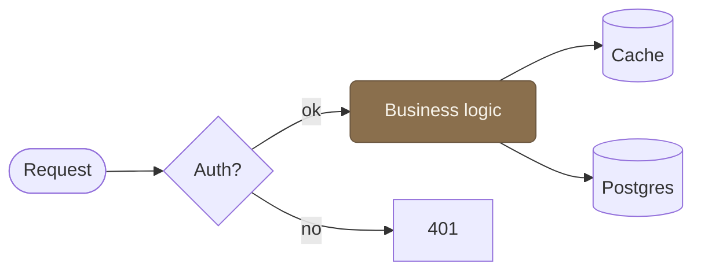

# Visual quality bar — diagrams & infographics

This is the single source of truth for adding a **visual** to a page: a diagram,
chart, architecture sketch, or infographic. It is the visual sibling of
[`CONTENT-QUALITY.md`](./CONTENT-QUALITY.md), and the same prime directive holds.

**Prime directive: a visual must earn its place.** The default is no diagram. Add one
only when it makes something *faster to understand* than the prose alone — a structure,
a flow, a comparison, a hierarchy. A picture that just restates the text is slop with
extra steps. When in doubt, leave it out.

This garden renders on **Quartz v4**, which gives us three techniques with **no extra
build tooling** — Mermaid, inline HTML/CSS, and inline SVG. Everything below is tuned to
what actually renders here, including this site's warm palette and automatic dark mode.

---

## 1. When a visual adds value (and when it doesn't)

**Reach for a visual when the content is inherently:**

- **A flow or process** — steps, pipelines, request paths, state changes → Mermaid `flowchart` / `sequenceDiagram` / `stateDiagram-v2`.
- **A structure or architecture** — services, components, how parts connect → Mermaid `flowchart` with subgraphs, or `architecture`, or inline SVG.
- **A hierarchy or map of ideas** → Mermaid `mindmap` or a `flowchart TD`.
- **A comparison or set of stats** — numbers, before/after, feature grids → inline HTML/CSS infographic (often clearer than a Mermaid diagram).
- **A chronology** → Mermaid `timeline`.
- **A 2×2 / prioritization** → Mermaid `quadrantChart`.

**Don't add a visual when:**

- The prose is already clear and linear. Three sentences beat a three-box flowchart.
- You'd be drawing a glorified bullet list. Use a list.
- It's decorative. No "hero" diagrams that say nothing.
- The data is a plain table → use a Markdown table.
- You can't describe what it clarifies in one sentence. If you can't, it doesn't.

---

## 2. The toolbox (and how to choose)

Three native techniques, ranked by how often they're the right call.

| Need | Use |
|---|---|
| Flow, architecture, sequence, state, hierarchy, timeline, ER/class, quadrant | **Mermaid** |
| Stats, comparisons, feature/step cards, callouts | **Inline HTML + CSS** |
| A precise custom layout no diagram tool handles (≤ ~25 shapes) | **Inline SVG** |

Quick decision rules:

- **Relational data → Mermaid.** It's native, theme-aware, LLMs know it well, and it
  has a built-in pan/zoom popup. This is ~85% of cases.
- **Tabular/quantitative data → HTML/CSS.** When you're fighting Mermaid to make it look
  like a grid of numbers, stop and write a small HTML card grid instead.
- **Bespoke layout → SVG.** Only when the visual is genuinely custom and Mermaid can't
  express it. Higher token cost, higher error rate — keep it small.

> **D2 (optional, manual):** for a showcase-quality architecture diagram, you can author
> [D2](https://d2lang.com) and render it to SVG yourself (`d2 in.d2 out.svg`), then embed
> the SVG. Beautiful output, but it's a manual build step — not for routine pages.

---

## 3. This site's palette (use these, nothing else)

The theme is warm and earthy. Colours come from CSS custom properties that **switch
automatically between light and dark**. Use the variables, never invent new colours.

| Token | Light | Dark | Role |
|---|---|---|---|
| `--light` | `#f7f3ea` | `#1b1a17` | page / node background |
| `--lightgray` | `#e7e0d1` | `#322f29` | surfaces, borders, hr |
| `--gray` | `#6f736d` | `#8c8a82` | muted text, metadata |
| `--darkgray` | `#2b302c` | `#d8d3c7` | body text |
| `--dark` | `#1f2421` | `#f2eee3` | headings |
| `--secondary` | `#53665a` | `#9db0a0` | **sage** — primary accent |
| `--tertiary` | `#8a6f4d` | `#c2a079` | **amber** — secondary accent |

Fonts: `--bodyFont` (Source Sans 3), `--headerFont` (Literata), `--codeFont` (Spline Sans Mono).

**Two accents, used sparingly.** Sage and amber are mid-tones that stay legible on both
the cream and the near-black background, so they're the safe choice for emphasis in any
technique. Don't reach past two accent colours per visual.

---

## 4. Mermaid: make it look good and stay dark-mode safe

Quartz already themes Mermaid for us — at render time it injects this site's colours as
`themeVariables` and re-renders on every light/dark toggle (`securityLevel: "loose"`, so
`<br/>` and rich labels work). That gives two rules:

1. **Let the theme do the base styling.** An un-styled diagram already matches the site
   in both modes. Don't fight it.
2. **Only `classDef`/`style` for emphasis**, and only with the **brand accents** (sage /
   amber), which read on both backgrounds. Avoid pinning node fills to mode-specific
   colours like `--light`/`--darkgray` — hardcoded hex in `classDef` does **not** switch
   when the reader flips dark mode, so a node forced to a light fill goes muddy at night.



The amber fill + cream text on the accented node is legible in both themes; everything
else inherits the site colours and adapts automatically.

**Mermaid house rules:**

- **Keep it small.** Max ~8 nodes per diagram/subgraph (Miller's 7±2). More than that →
  split into focused diagrams or group with `subgraph`.
- **Direction:** `LR` for processes/pipelines, `TD` for hierarchies/trees. On mobile the
  content column is ~760px — wide `LR` diagrams with many nodes overflow; prefer `TD`.
- **Label edges** with 1–3 words ("valid token", "on failure"). Never a full sentence.
- **One shape per role:** `[box]` process, `{diamond}` decision, `[(cylinder)]` store,
  `([stadium])` endpoint. Be consistent.
- **Always add `accTitle` + `accDescr`** (first lines) — Quartz's Mermaid output has no
  accessible label otherwise.
- **Never** use `%%{init: {theme: "forest"}}%%` here — Quartz's injected variables bleed
  into the named theme and produce muddy, unpredictable colours. If you must tweak a
  theme variable, target it precisely: `%%{init: {themeVariables: {edgeLabelBackground: "#e7e0d1"}}}%%`.

---

## 5. Inline SVG & HTML: the dark-mode-safe way

Quartz passes raw HTML/SVG straight through (`rehype-raw`, `allowDangerousHtml`), so both
render. Two non-negotiables:

**Use CSS variables for every colour — but only inside `style`, not bare attributes.**
`fill="var(--tertiary)"` silently fails; it must be `style="fill:var(--tertiary)"` (or a
`<style>` block with classes). This is the single most common SVG mistake here.

```html
<!-- WRONG: var() in a presentation attribute does nothing -->
<rect fill="var(--tertiary)" />
<!-- RIGHT -->
<rect style="fill: var(--tertiary);" />
```

**Make it responsive.** Always `viewBox` + `width="100%"`, never a fixed pixel `width`/
`height` — otherwise it overflows on mobile.

Accessible, responsive, dark-mode-safe SVG skeleton:

```html
<figure role="group" aria-labelledby="fig-title">
  <svg xmlns="http://www.w3.org/2000/svg" viewBox="0 0 640 220" width="100%"
       style="max-width:100%;height:auto;font-family:var(--bodyFont);"
       role="img" aria-labelledby="fig-title fig-desc">
    <title id="fig-title">Short title for screen readers</title>
    <desc id="fig-desc">One or two sentences describing the structure and flow.</desc>
    <style>
      .box   { fill: var(--lightgray); stroke: var(--tertiary); stroke-width: 1.5; }
      .accent{ fill: var(--secondary); stroke: none; }
      .label { fill: var(--darkgray); font-size: 13px; text-anchor: middle; }
      .inv   { fill: var(--light);    font-size: 13px; text-anchor: middle; }
    </style>
    <!-- shapes here -->
  </svg>
  <figcaption style="text-align:center;color:var(--gray);font-size:0.85em;margin-top:0.5rem;">
    Figure: caption visible to everyone
  </figcaption>
</figure>
```

HTML infographics follow the same rules — `var(--...)` for all colours, `rem`/`%`/
`clamp()` for sizes, `flex-wrap`/`grid auto-fit` so cards reflow on mobile. A stat-card grid:

```html
<div style="display:grid;grid-template-columns:repeat(auto-fit,minmax(150px,1fr));gap:1rem;margin:1.5rem 0;font-family:var(--bodyFont);">
  <div style="background:var(--lightgray);border:1px solid var(--tertiary);border-radius:8px;padding:1.2rem 1rem;text-align:center;">
    <div style="font-size:2rem;font-weight:700;color:var(--tertiary);line-height:1;">3</div>
    <div style="font-size:.8rem;color:var(--gray);margin-top:.4rem;text-transform:uppercase;letter-spacing:.05em;">native techniques</div>
  </div>
  <div style="background:var(--secondary);border-radius:8px;padding:1.2rem 1rem;text-align:center;">
    <div style="font-size:2rem;font-weight:700;color:var(--light);line-height:1;">0</div>
    <div style="font-size:.8rem;color:var(--lightgray);margin-top:.4rem;text-transform:uppercase;letter-spacing:.05em;">extra plugins</div>
  </div>
</div>
```

**Never** put `<script>` tags or external CDN frameworks (Tailwind, etc.) in a page. Keep
styles inline and minimal.

---

## 6. Reliability: the failure modes to self-check

LLMs break diagrams in predictable ways. Before committing a visual, run this pass:

- [ ] Every edge's source and target is a **declared node**.
- [ ] Labels with `()`, `:`, `/` or other specials are **quoted**: `A["User (admin)"]`.
- [ ] `classDef` is declared **before** it's used with `:::name`.
- [ ] Flowchart/state transitions use `-->`, not `->` (that's sequence-only).
- [ ] `mindmap`/`timeline` indentation is consistent (spaces, not mixed tabs).
- [ ] SVG colours use `style="fill:var(--…)"`, **not** `fill="var(--…)"`.
- [ ] SVG has `viewBox` + `width="100%"`; no fixed pixel width.
- [ ] `accTitle`/`accDescr` (Mermaid) or `<title>`/`<desc>` (SVG) are present.
- [ ] Node count is sane (≤ ~8); if not, split or group.

**When practical, verify it renders** before opening the PR: `npx quartz build --serve`
and look at the page. Mermaid syntax errors fail silently into an ugly block.

---

## 7. Accessibility & robustness checklist

- **Describe it.** `accTitle`/`accDescr` for Mermaid; `<title>` + `<desc>` for SVG; a
  `<figcaption>` or a `> [!abstract]` callout under the figure for everyone else.
- **Dark mode.** Colours come from `var(--...)` or the two brand accents — nothing
  hardcoded that only works on one background.
- **Mobile.** Responsive sizing (`viewBox`+`width:100%`, reflowing card grids); prefer
  `TD` for tall content.
- **Graceful fallback.** The surrounding prose must still make sense if the visual fails
  to render. The diagram supports the text; it never carries it alone.

---

When auditing a visual, the same verdict logic as [`CONTENT-QUALITY.md`](./CONTENT-QUALITY.md)
applies: if it doesn't make the idea faster to grasp, it's a REVISE — cut it or fix it.
