# Pattern library — copy-paste infographics & diagrams

A curated set of **verified** recipes for this site. Every snippet here has been rendered
through Quartz and checked in both light and dark mode, so quality is repeatable instead
of free-handed. Workflow: **pick the closest pattern → swap in the page's real content →
re-verify it renders.** Don't invent layout from scratch when one of these fits.

This is the recipe layer. [`DIAGRAMS.md`](../../DIAGRAMS.md) is the *why* (when a visual
earns its place, the palette, the dark-mode rules, the reliability checklist). Read that
first; this file is what you reach for once you've decided to draw something.

---

## ⚠️ The one HTML rule that breaks everything

Quartz runs pages through a Markdown parser before the HTML reaches the browser. Inside a
raw HTML block:

- **No blank lines.** A blank line ends the HTML block; whatever follows is parsed as
  Markdown again.
- **Never indent an inner line by 4+ spaces.** A blank line followed by a 4-space-indented
  line is read as an **indented code block** — your `<div>`s render as literal grey code.

So: keep multi-element HTML blocks **gap-free**, and indent inner lines by **2 spaces max**
(or not at all). The grid-based patterns below (swimlane especially) are deliberately
flattened for this reason. When a visual mysteriously renders as a code block, this is why.

Everything else: colours are always `var(--…)` or the two brand accents; use `style="…"`
for SVG fills (bare `fill="var(--…)"` silently fails); size with `rem`/`%`/`auto-fit` so it
reflows on mobile.

---

## How to choose

| The content is… | Reach for | Pattern |
|---|---|---|
| A process / pipeline / request path | Mermaid | [Flowchart](#flowchart--pipeline) |
| Services & how they connect | Mermaid | [Architecture w/ subgraphs](#architecture-with-subgraphs) |
| Actors exchanging messages over time | Mermaid | [Sequence](#sequence) |
| A lifecycle / status machine | Mermaid | [State](#state-machine) |
| A 2×2 / prioritization | Mermaid | [Quadrant](#quadrant--2×2) |
| Branch/merge / version history | Mermaid | [Git graph](#git-graph) |
| **Headline numbers** | HTML | [Stat cards](#stat-cards) |
| **A chronology / "how we got here"** | HTML | [Vertical timeline](#vertical-timeline) |
| **An ordered how-to (1-2-3)** | HTML | [Numbered stepper](#numbered-stepper) |
| **Who does what, across stages** | HTML | [Swimlane](#swimlane) |
| **A vs B** | HTML | [Comparison](#comparison-a-vs-b) |
| **Trade-offs / keeps vs costs** | HTML | [Pros & cons](#pros--cons) |
| **"At a glance" facts** | HTML | [Spec list](#spec-list) |
| **Relative magnitudes / a mix** | HTML | [Meter bars](#meter-bars) |
| **A line worth pausing on** | HTML | [Pull quote](#pull-quote) |

Rule of thumb: **relational → Mermaid; quantitative or editorial layout → HTML.** A garden
page should *vary its texture* — a wall of flat prose tires the reader as much as a wall of
boxes. But every visual still has to clarify, not decorate.

---

# Signature system motifs (reuse first)

These are the recurring visuals for this garden's core thesis. Reuse these when they fit so
readers see one coherent visual language across pages.

## Capability ladder (chatbot → copilot → system operator)

````markdown
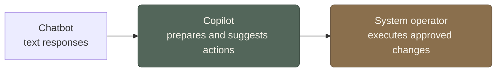
````

## Coordination boundary (process-scoped orchestrator vs system-scoped specialists)

````markdown
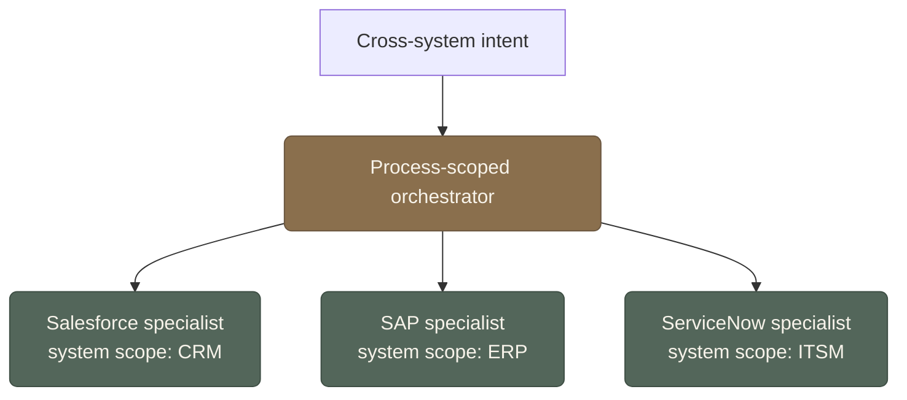
````

## Memory stack (enterprise layers)

````markdown
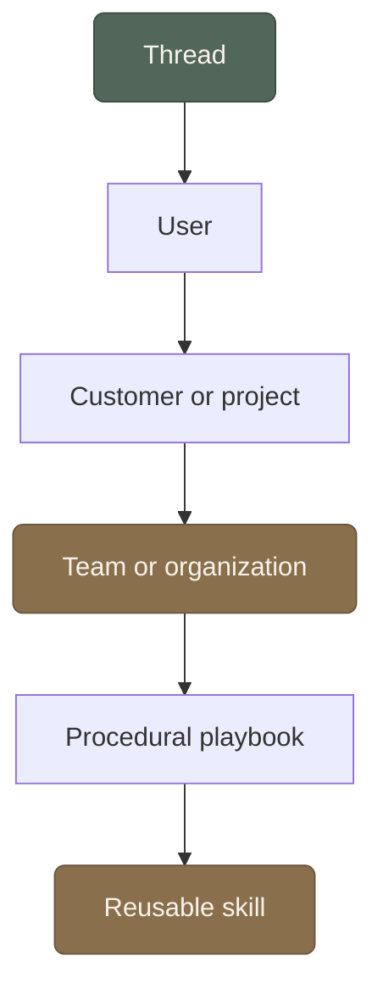
````

## Action surface map (GUI / API / CLI / DSL)

````markdown
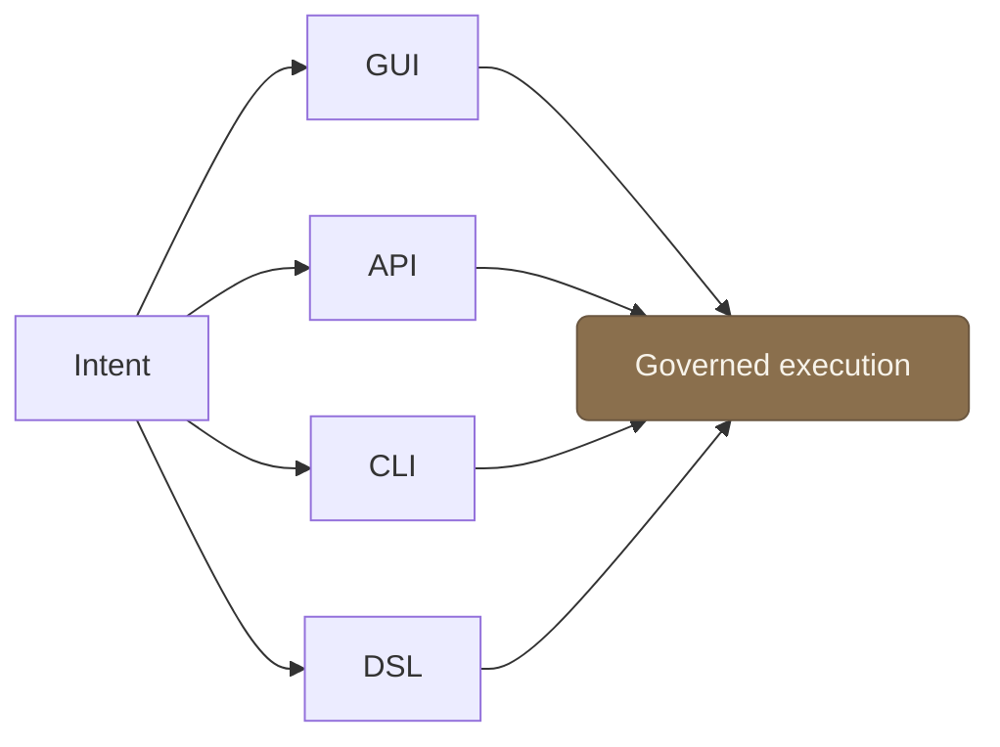
````

## Governance loop (intent → approval → action → trace → evaluation)

````markdown
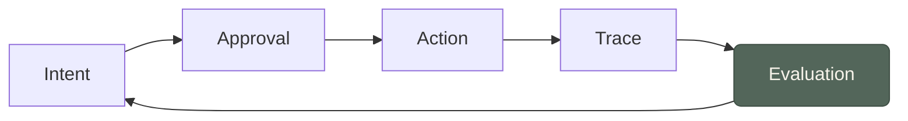
````

---

# Mermaid patterns

Quartz injects the site palette as Mermaid `themeVariables` and re-renders on every
light/dark toggle, so an **un-styled** diagram already matches the site. Accent only with
the brand colours via `classDef` (sage `#53665a` / amber `#8a6f4d`). Always lead with
`accTitle` + `accDescr`.

## Flowchart / pipeline

A left-to-right process with a decision and a loop-back. `LR` for pipelines, `TD` for trees.

````markdown
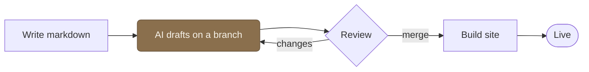
````

## Architecture with subgraphs

Group components into labelled boxes; accent the one that matters.

````markdown
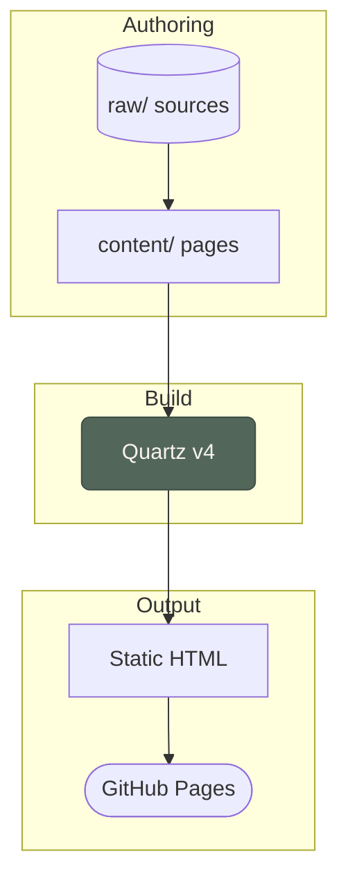
````

## Sequence

Actors and messages over time. `->>` solid call, `-->>` dashed return.

````markdown
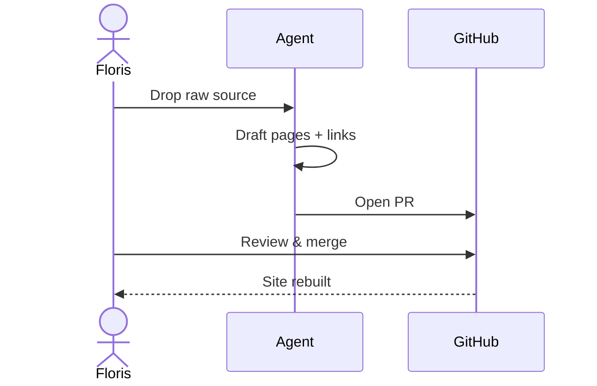
````

## State machine

A lifecycle with labelled transitions.

````markdown
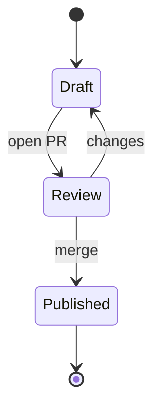
````

## Quadrant / 2×2

Place items by two axes. Great for effort-vs-impact, risk-vs-reward.

````markdown
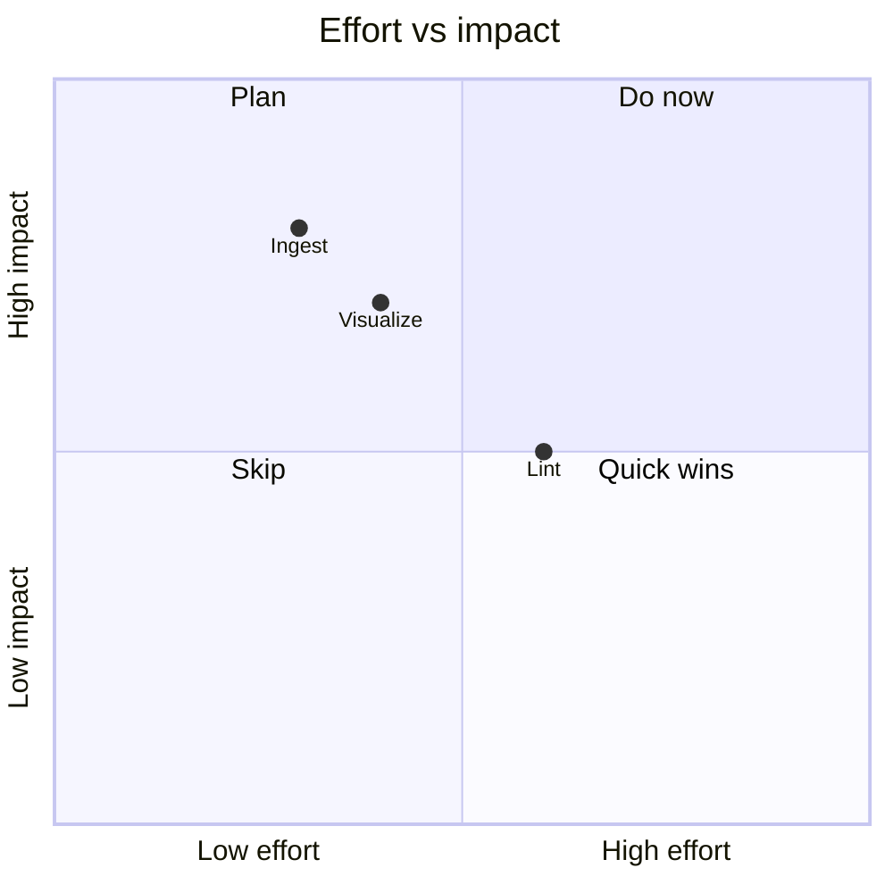
````

## Git graph

Branch / commit / merge history.

````markdown
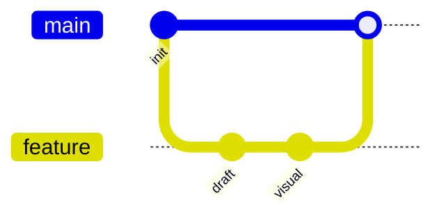
````

> **⚠️ Avoid Mermaid `timeline` and `mindmap` here.** Their auto colour scales fight this
> palette and render low-contrast (dark text on dark fills), and the `%%{init: theme}%%`
> fix is banned (§4 of DIAGRAMS.md). For a **chronology** use the HTML
> [vertical timeline](#vertical-timeline) below; for a **hierarchy / idea map** use a
> `flowchart TD`. Both look far better in this theme.

---

# HTML infographic patterns

All verified gap-free with ≤2-space indentation (see the rule at the top). Colours are
`var(--…)` tokens + the two accents, so every one flips correctly in dark mode.

## Stat cards

Headline numbers in a reflowing grid. Accent at most one card.

```html
<div style="display:grid;grid-template-columns:repeat(auto-fit,minmax(140px,1fr));gap:1rem;margin:1.5rem 0;font-family:var(--bodyFont);">
  <div style="background:var(--lightgray);border:1px solid var(--tertiary);border-radius:10px;padding:1.2rem 1rem;text-align:center;">
    <div style="font-size:2rem;font-weight:700;color:var(--tertiary);line-height:1;">3</div>
    <div style="font-size:.78rem;color:var(--gray);margin-top:.4rem;text-transform:uppercase;letter-spacing:.05em;">layers</div>
  </div>
  <div style="background:var(--secondary);border-radius:10px;padding:1.2rem 1rem;text-align:center;">
    <div style="font-size:2rem;font-weight:700;color:var(--light);line-height:1;">0</div>
    <div style="font-size:.78rem;color:var(--lightgray);margin-top:.4rem;text-transform:uppercase;letter-spacing:.05em;">plugins added</div>
  </div>
  <div style="background:var(--lightgray);border:1px solid var(--gray);border-radius:10px;padding:1.2rem 1rem;text-align:center;">
    <div style="font-size:2rem;font-weight:700;color:var(--dark);line-height:1;">∞</div>
    <div style="font-size:.78rem;color:var(--gray);margin-top:.4rem;text-transform:uppercase;letter-spacing:.05em;">edit history</div>
  </div>
</div>
```

## Vertical timeline

A chronology with dots on a rail. The dot uses `left:calc(-1.6rem - 8px)` to sit on the
border; alternate sage/amber dots if you like. **This is the chronology pattern** — prefer
it over Mermaid `timeline`.

```html
<div style="position:relative;border-left:2px solid var(--lightgray);margin:1.5rem 0 1.5rem .5rem;padding-left:1.6rem;display:flex;flex-direction:column;gap:1.4rem;font-family:var(--bodyFont);">
  <div style="position:relative;">
    <span style="position:absolute;left:calc(-1.6rem - 8px);top:.15rem;width:13px;height:13px;border-radius:50%;background:var(--tertiary);border:2px solid var(--light);"></span>
    <div style="font-size:.76rem;text-transform:uppercase;letter-spacing:.05em;color:var(--tertiary);font-weight:700;">2023</div>
    <div style="font-weight:700;color:var(--dark);">The idea</div>
    <div style="color:var(--gray);font-size:.92rem;">A wiki an AI maintains but I control.</div>
  </div>
  <div style="position:relative;">
    <span style="position:absolute;left:calc(-1.6rem - 8px);top:.15rem;width:13px;height:13px;border-radius:50%;background:var(--secondary);border:2px solid var(--light);"></span>
    <div style="font-size:.76rem;text-transform:uppercase;letter-spacing:.05em;color:var(--secondary);font-weight:700;">2024</div>
    <div style="font-weight:700;color:var(--dark);">First pages</div>
    <div style="color:var(--gray);font-size:.92rem;">Quartz set up; the garden goes public.</div>
  </div>
  <div style="position:relative;">
    <span style="position:absolute;left:calc(-1.6rem - 8px);top:.15rem;width:13px;height:13px;border-radius:50%;background:var(--secondary);border:2px solid var(--light);"></span>
    <div style="font-size:.76rem;text-transform:uppercase;letter-spacing:.05em;color:var(--secondary);font-weight:700;">2025</div>
    <div style="font-weight:700;color:var(--dark);">Agentic pipeline</div>
    <div style="color:var(--gray);font-size:.92rem;">Skills, agents, and a quality gate.</div>
  </div>
</div>
```

## Numbered stepper

An ordered how-to. Reflows to a column on mobile.

```html
<div style="display:grid;grid-template-columns:repeat(auto-fit,minmax(160px,1fr));gap:1rem;margin:1.5rem 0;font-family:var(--bodyFont);">
  <div style="background:var(--lightgray);border-radius:10px;padding:1.1rem;display:flex;flex-direction:column;gap:.4rem;">
    <span style="width:1.8rem;height:1.8rem;border-radius:50%;background:var(--secondary);color:var(--light);font-weight:700;display:flex;align-items:center;justify-content:center;">1</span>
    <div style="font-weight:700;color:var(--dark);">Drop a source</div>
    <div style="color:var(--gray);font-size:.9rem;">A file or link lands in raw/.</div>
  </div>
  <div style="background:var(--lightgray);border-radius:10px;padding:1.1rem;display:flex;flex-direction:column;gap:.4rem;">
    <span style="width:1.8rem;height:1.8rem;border-radius:50%;background:var(--secondary);color:var(--light);font-weight:700;display:flex;align-items:center;justify-content:center;">2</span>
    <div style="font-weight:700;color:var(--dark);">AI files it</div>
    <div style="color:var(--gray);font-size:.9rem;">Pages drafted and cross-linked.</div>
  </div>
  <div style="background:var(--lightgray);border-radius:10px;padding:1.1rem;display:flex;flex-direction:column;gap:.4rem;">
    <span style="width:1.8rem;height:1.8rem;border-radius:50%;background:var(--secondary);color:var(--light);font-weight:700;display:flex;align-items:center;justify-content:center;">3</span>
    <div style="font-weight:700;color:var(--dark);">I review</div>
    <div style="color:var(--gray);font-size:.9rem;">Merge what I agree with.</div>
  </div>
</div>
```

## Swimlane

Who does what, across stages. A CSS grid: first column = lane labels, header row = stages,
accent cells = the action in that lane/stage; empty cells are dashed placeholders.
**Kept flattened (no indentation, no blank lines)** — this is the pattern most likely to
break the code-block trap. `overflow-x:auto` + `min-width` let it scroll on mobile.

```html
<div style="overflow-x:auto;margin:1.5rem 0;font-family:var(--bodyFont);">
<div style="display:grid;grid-template-columns:max-content repeat(3,minmax(110px,1fr));gap:.5rem;min-width:520px;">
<div></div>
<div style="text-align:center;font-size:.74rem;text-transform:uppercase;letter-spacing:.05em;color:var(--gray);font-weight:700;padding:.3rem;">Draft</div>
<div style="text-align:center;font-size:.74rem;text-transform:uppercase;letter-spacing:.05em;color:var(--gray);font-weight:700;padding:.3rem;">Review</div>
<div style="text-align:center;font-size:.74rem;text-transform:uppercase;letter-spacing:.05em;color:var(--gray);font-weight:700;padding:.3rem;">Publish</div>
<div style="display:flex;align-items:center;font-weight:700;color:var(--dark);padding-right:.5rem;">Floris</div>
<div style="background:var(--light);border:1px dashed var(--lightgray);border-radius:8px;"></div>
<div style="background:var(--tertiary);color:var(--light);border-radius:8px;padding:.6rem;font-size:.85rem;text-align:center;">Review &amp; merge</div>
<div style="background:var(--light);border:1px dashed var(--lightgray);border-radius:8px;"></div>
<div style="display:flex;align-items:center;font-weight:700;color:var(--dark);padding-right:.5rem;">Agent</div>
<div style="background:var(--secondary);color:var(--light);border-radius:8px;padding:.6rem;font-size:.85rem;text-align:center;">Draft pages</div>
<div style="background:var(--light);border:1px dashed var(--lightgray);border-radius:8px;"></div>
<div style="background:var(--light);border:1px dashed var(--lightgray);border-radius:8px;"></div>
<div style="display:flex;align-items:center;font-weight:700;color:var(--dark);padding-right:.5rem;">GitHub</div>
<div style="background:var(--light);border:1px dashed var(--lightgray);border-radius:8px;"></div>
<div style="background:var(--light);border:1px dashed var(--lightgray);border-radius:8px;"></div>
<div style="background:var(--lightgray);border:1px solid var(--gray);border-radius:8px;padding:.6rem;font-size:.85rem;text-align:center;color:var(--darkgray);">Build &amp; deploy</div>
</div>
</div>
```

## Comparison (A vs B)

Two cards, each with an accent header and a list. Sage vs amber reads as "two options".

```html
<div style="display:grid;grid-template-columns:repeat(auto-fit,minmax(220px,1fr));gap:1rem;margin:1.5rem 0;font-family:var(--bodyFont);">
  <div style="border:1px solid var(--lightgray);border-radius:10px;overflow:hidden;">
    <div style="background:var(--tertiary);color:var(--light);font-weight:700;padding:.6rem 1rem;">A blog</div>
    <ul style="margin:0;padding:.8rem 1rem .8rem 1.4rem;color:var(--darkgray);font-size:.92rem;">
      <li>A stream of posts</li>
      <li>Frozen once published</li>
      <li>No links between ideas</li>
    </ul>
  </div>
  <div style="border:1px solid var(--secondary);border-radius:10px;overflow:hidden;">
    <div style="background:var(--secondary);color:var(--light);font-weight:700;padding:.6rem 1rem;">A garden</div>
    <ul style="margin:0;padding:.8rem 1rem .8rem 1.4rem;color:var(--darkgray);font-size:.92rem;">
      <li>A web that compounds</li>
      <li>Revised as thinking changes</li>
      <li>Cross-linked throughout</li>
    </ul>
  </div>
</div>
```

## Pros & cons

Trade-offs side by side. The `✔`/`✘` glyphs render in their own colour; that's fine, or
wrap them in a coloured `<span>` if you want them on-palette.

```html
<div style="display:grid;grid-template-columns:repeat(auto-fit,minmax(220px,1fr));gap:1rem;margin:1.5rem 0;font-family:var(--bodyFont);">
  <div style="background:var(--lightgray);border-left:5px solid var(--secondary);border-radius:8px;padding:.9rem 1.1rem;">
    <div style="font-weight:700;color:var(--secondary);margin-bottom:.4rem;">Keeps</div>
    <div style="color:var(--darkgray);font-size:.92rem;line-height:1.5;">✔ Compounds over time<br/>✔ Easy to cross-reference<br/>✔ Full version history</div>
  </div>
  <div style="background:var(--lightgray);border-left:5px solid var(--tertiary);border-radius:8px;padding:.9rem 1.1rem;">
    <div style="font-weight:700;color:var(--tertiary);margin-bottom:.4rem;">Costs</div>
    <div style="color:var(--darkgray);font-size:.92rem;line-height:1.5;">✘ Needs tending<br/>✘ Slower than posting<br/>✘ Structure to maintain</div>
  </div>
</div>
```

## Spec list

"At a glance" facts as an aligned definition list. Cleaner than a 2-column table for short
key/value pairs.

```html
<dl style="margin:1.5rem 0;font-family:var(--bodyFont);border-top:1px solid var(--lightgray);">
  <div style="display:flex;gap:1rem;padding:.6rem 0;border-bottom:1px solid var(--lightgray);">
    <dt style="flex:0 0 9rem;color:var(--gray);text-transform:uppercase;font-size:.76rem;letter-spacing:.05em;font-weight:700;padding-top:.1rem;">Renderer</dt>
    <dd style="margin:0;color:var(--darkgray);font-weight:600;">Quartz v4</dd>
  </div>
  <div style="display:flex;gap:1rem;padding:.6rem 0;border-bottom:1px solid var(--lightgray);">
    <dt style="flex:0 0 9rem;color:var(--gray);text-transform:uppercase;font-size:.76rem;letter-spacing:.05em;font-weight:700;padding-top:.1rem;">Format</dt>
    <dd style="margin:0;color:var(--darkgray);font-weight:600;">Markdown + YAML</dd>
  </div>
  <div style="display:flex;gap:1rem;padding:.6rem 0;border-bottom:1px solid var(--lightgray);">
    <dt style="flex:0 0 9rem;color:var(--gray);text-transform:uppercase;font-size:.76rem;letter-spacing:.05em;font-weight:700;padding-top:.1rem;">Hosting</dt>
    <dd style="margin:0;color:var(--darkgray);font-weight:600;">GitHub Pages</dd>
  </div>
</dl>
```

## Meter bars

Relative magnitudes. The track is `--lightgray`; the fill is an accent at a `%` width.

```html
<div style="display:flex;flex-direction:column;gap:.9rem;margin:1.5rem 0;font-family:var(--bodyFont);">
  <div>
    <div style="display:flex;justify-content:space-between;font-size:.88rem;color:var(--darkgray);margin-bottom:.25rem;"><span>Prose</span><span style="color:var(--gray);">70%</span></div>
    <div style="height:.6rem;background:var(--lightgray);border-radius:999px;overflow:hidden;"><div style="width:70%;height:100%;background:var(--secondary);"></div></div>
  </div>
  <div>
    <div style="display:flex;justify-content:space-between;font-size:.88rem;color:var(--darkgray);margin-bottom:.25rem;"><span>Diagrams</span><span style="color:var(--gray);">20%</span></div>
    <div style="height:.6rem;background:var(--lightgray);border-radius:999px;overflow:hidden;"><div style="width:20%;height:100%;background:var(--tertiary);"></div></div>
  </div>
  <div>
    <div style="display:flex;justify-content:space-between;font-size:.88rem;color:var(--darkgray);margin-bottom:.25rem;"><span>Code</span><span style="color:var(--gray);">10%</span></div>
    <div style="height:.6rem;background:var(--lightgray);border-radius:999px;overflow:hidden;"><div style="width:10%;height:100%;background:var(--gray);"></div></div>
  </div>
</div>
```

## Pull quote

Break up a long passage with a line worth pausing on. Uses the header font and an accent rule.

```html
<blockquote style="margin:1.5rem 0;padding:.6rem 0 .6rem 1.4rem;border-left:4px solid var(--tertiary);font-family:var(--headerFont);font-size:1.3rem;line-height:1.4;color:var(--dark);font-style:italic;">
  A blog is a stream. A wiki compounds.
  <footer style="margin-top:.5rem;font-family:var(--bodyFont);font-size:.85rem;font-style:normal;color:var(--gray);">— how this site works</footer>
</blockquote>
```

---

## Before you commit

Quick pass (full checklist in [`DIAGRAMS.md`](../../DIAGRAMS.md) §6–7):

- [ ] HTML block has **no blank lines** and **no 4-space-indented** inner lines.
- [ ] Every colour is a `var(--…)` token or a brand accent — nothing hardcoded to one mode.
- [ ] SVG fills use `style="fill:var(--…)"`, not `fill="var(--…)"`.
- [ ] It reflows at ~760px (grids `auto-fit`, wide blocks `overflow-x:auto` + `min-width`).
- [ ] Mermaid has `accTitle`/`accDescr`; HTML/SVG has a caption or `<figcaption>`/`<desc>`.
- [ ] You skipped Mermaid `timeline`/`mindmap` in favour of the HTML timeline / `flowchart TD`.
- [ ] It **renders** — `npx quartz build --serve` and look, in light *and* dark.
