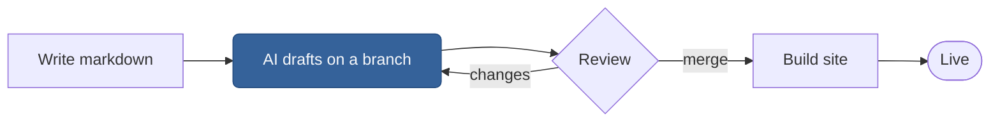
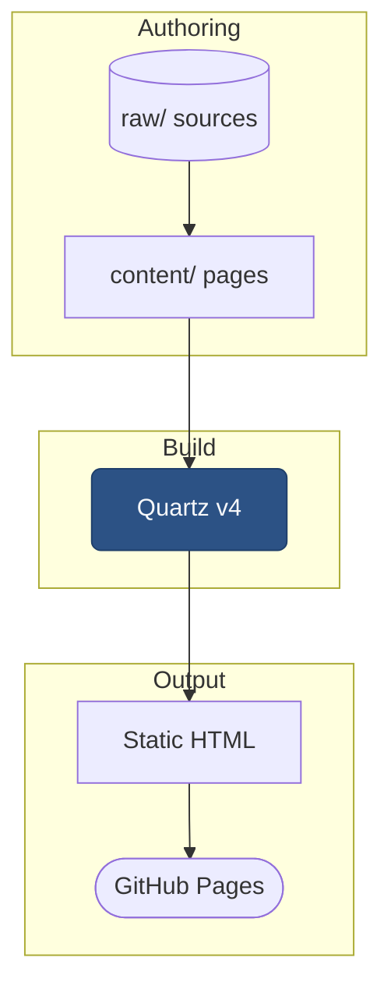
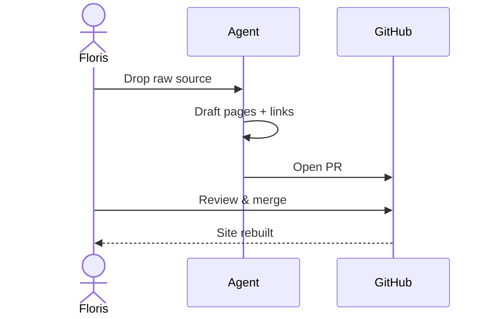
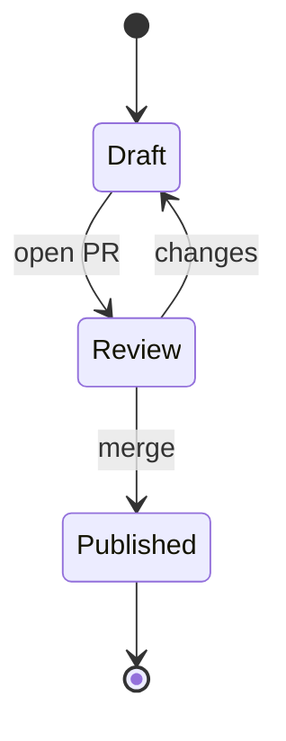
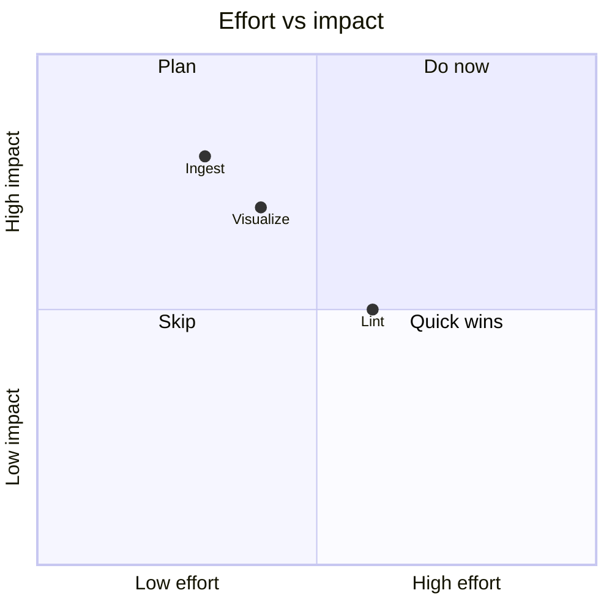
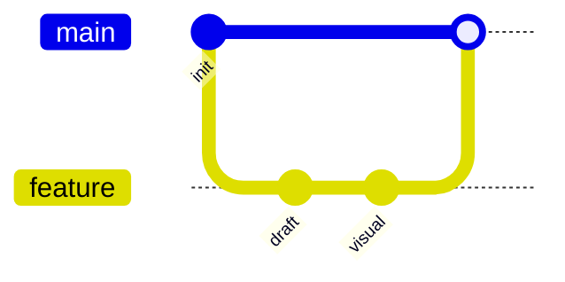

# Pattern library - copy-paste infographics & diagrams

A curated set of recipes for this site. The legacy patterns and integrated editorial
specimens have been rendered through Quartz in both themes; new adapted snippets still
need their own exact-output check. Workflow: **pick the closest pattern → swap in real content →
re-verify it renders.** Reuse a fitting layout, not one that hides the argument.
For bespoke figures, use the [editorial procedure](./references/EDITORIAL.md).

This is the recipe layer. [`DIAGRAMS.md`](../../DIAGRAMS.md) is the _why_ (when a visual
earns its place, the palette, the dark-mode rules, the reliability checklist). Read that
first; this file is what you reach for once you've decided to draw something.

---

## The one HTML rule that breaks everything

Quartz runs pages through a Markdown parser before the HTML reaches the browser. Inside a
raw HTML block:

- **No blank lines.** A blank line ends the HTML block; whatever follows is parsed as
  Markdown again.
- **Never indent an inner line by 4+ spaces.** A blank line followed by a 4-space-indented
  line is read as an **indented code block** - your `<div>`s render as literal grey code.

So: keep multi-element HTML blocks **gap-free**, and indent inner lines by **2 spaces max**
(or not at all). The grid-based patterns below (swimlane especially) are deliberately
flattened for this reason. When a visual mysteriously renders as a code block, this is why.

Everything else: use current site colours or the scoped `--plate-*` aliases inside an
`.editorial-plate`; use `style="…"` for SVG fills (bare `fill="var(--…)"` silently
fails); size with `rem`/`%`/`auto-fit` so it reflows on mobile.

---

## How to choose

| The content is…                                | Reach for  | Pattern                                                                   |
| ---------------------------------------------- | ---------- | ------------------------------------------------------------------------- |
| A process / pipeline / request path            | Mermaid    | [Flowchart](#flowchart--pipeline)                                         |
| Services & how they connect                    | Mermaid    | [Architecture w/ subgraphs](#architecture-with-subgraphs)                 |
| Actors exchanging messages over time           | Mermaid    | [Sequence](#sequence)                                                     |
| A lifecycle / status machine                   | Mermaid    | [State](#state-machine)                                                   |
| A 2×2 / prioritization                         | Mermaid    | [Quadrant](#quadrant--2×2)                                                |
| Branch/merge / version history                 | Mermaid    | [Git graph](#git-graph)                                                   |
| **Headline numbers**                           | HTML       | [Stat cards](#stat-cards)                                                 |
| **A chronology / "how we got here"**           | HTML       | [Vertical timeline](#vertical-timeline)                                   |
| **An ordered how-to (1-2-3)**                  | HTML       | [Numbered stepper](#numbered-stepper)                                     |
| **Who does what, across stages**               | HTML       | [Swimlane](#swimlane)                                                     |
| **A vs B**                                     | HTML       | [Comparison](#comparison-a-vs-b)                                          |
| **Trade-offs / keeps vs costs**                | HTML       | [Pros & cons](#pros--cons)                                                |
| **"At a glance" facts**                        | HTML       | [Spec list](#spec-list)                                                   |
| **Relative magnitudes / a mix**                | HTML       | [Meter bars](#meter-bars)                                                 |
| **A line worth pausing on**                    | HTML       | [Pull quote](#pull-quote)                                                 |
| **A cleaner custom sketch**                    | SVG        | [Sketch board (inline SVG)](#sketch-board-inline-svg)                     |
| **A relationship the set should make visible** | HTML / SVG | [Compositions from reviewed figures](#compositions-from-reviewed-figures) |
| **A claim with a visible boundary**            | HTML       | [Editorial plate frame](#editorial-plate-frame)                           |
| **Separately bounded destinations**            | HTML       | [Authority handoffs](#authority-handoffs)                                 |
| **Sequence versus overlap**                    | HTML       | [Illustrative schedule comparison](#illustrative-schedule-comparison)     |

Rule of thumb: **simple relationships → Mermaid; reflowing editorial layout → HTML;
precise geometry → SVG.** A garden
page should _vary its texture_ - a wall of flat prose tires the reader as much as a wall of
boxes. But every visual still has to clarify, not decorate.

For a set of figures, compare the inner geometry, not only the shared frame or palette.
Different claims may need a rail, fan-out, fork/join, nesting, paired comparison, or return
path. There is no target number of layouts: keep a repeated form when the relationship is
the same, and change it when the form hides a different relationship. Never add a branch,
mark, or ornament just to make a contact sheet look varied.

---

## Editorial plate frame

The public figures also use scoped composition helpers from `custom.scss`:
`.plate-sequence` for ordered stages, `.plate-gate` for a conditional transition,
`.plate-nest` for containment, `.plate-route` for independently bounded destinations,
and `.plate-grid` for categorical comparisons. `.plate-grid--alternatives` preserves
two branches on mobile; use it only when both labels still fit at 14px or larger.
Ordinary grids stack below 600px. Do not use sequence numbers for unordered categories,
or a stacked destination layout that implies one destination hands work to the next.

Use `.editorial-plate` for a bespoke, claim-led figure that benefits from warm paper,
hairline ink, a serif claim and mono apparatus. The classes install a figure-scoped
palette and frame in `quartz/styles/custom.scss`; the rest of the page and `.sketch-board`
retain their existing styling. This is framing, not a diagram layout: supply geometry
that expresses the source-backed relationship.

The claim is the visible heading. Give the figure a unique `id` for `aria-labelledby`,
and a real text description for `aria-describedby`; the figcaption stays visible and
includes source, evidence status and relevant limits. Keep the native `<figure>` role;
do not override it with `role="group"`. Palette is never the only distinction. Reflow
HTML rows/lanes at narrow widths, preserve essential labels at 14px or larger, and keep
caveats next to the encoding they qualify. Avoid fixed-width plates, numeric axes without
source values, and order or size that suggests unsupported rank.

```html
<figure
  id="reach-figure"
  class="editorial-plate"
  aria-labelledby="reach-title"
  aria-describedby="reach-description"
>
  <div class="plate-tab">SCOPE / QUALITATIVE</div>
  <div class="plate-body">
    <h3 id="reach-title" class="plate-claim">Audience widens; promotion is deliberate.</h3>
    <p id="reach-description">
      Four equal rows show the source's qualitative order from a conversation to shared
      organizational context. They are categories, not measured sizes or a required progression.
    </p>
    <p class="plate-apparatus">NARROWER → SHARED · QUALITATIVE</p>
    <div class="plate-graphic">
      <div class="scope-row"><strong>Thread</strong><span>Current conversation</span></div>
      <div class="scope-row"><strong>Person</strong><span>One person's preferences</span></div>
      <div class="scope-row"><strong>Engagement</strong><span>One project or customer</span></div>
      <div class="scope-row"><strong>Organization</strong><span>Shared context</span></div>
    </div>
    <p class="plate-interpretation">
      Keep a memory at the lowest useful scope; widening is not automatic.
    </p>
  </div>
  <figcaption class="plate-source">
    Qualitative relationship, not a measured scale. Source: replace with the page's exact source and
    section.
  </figcaption>
</figure>
```

**Required layout CSS for this snippet** (keep it page-scoped unless repeated use earns a
shared component):

```css
.scope-row {
  display: grid;
  grid-template-columns: minmax(8rem, 0.8fr) minmax(0, 1.5fr);
  gap: 1rem;
  padding: 0.8rem;
  border-top: 1px solid var(--plate-ink);
  background: var(--plate-inset);
}
.plate-graphic {
  border-bottom: 1px solid var(--plate-ink);
}
@media (max-width: 600px) {
  .scope-row {
    grid-template-columns: minmax(0, 1fr);
    gap: 0.25rem;
  }
}
```

Replace example names and explanations with source-backed categories; keep equal row
widths only when width is not itself evidence. If order is meaningful, label the dimension
beside the rows and say whether it is qualitative. On mobile, stack the text columns
without shrinking type. Distinguish a second dimension structurally, such as with a
heavier divider and its own heading, rather than appending it as another row. The
composition was demonstrated by the memory-scope specimen; each adaptation still needs
its own source and render check.

For the full experiment process, including image-based critique and stopping conditions,
follow [`references/LEARNING-LOOP.md`](./references/LEARNING-LOOP.md).

---

## Authority handoffs

Use when one coordinator routes separate operations into independently bounded systems.
Keep the coordinator distinct from the targets. Draw each handoff outside its
destination, with the arrow meeting that destination's border; put one shared origin
label above repeated targets instead of repeating boilerplate. Each target remains its
own semantic section, and a shared permission note must retain the per-system boundary.
Label inspection versus mutation in text, not color alone.

```html
<figure
  id="handoff-figure"
  class="editorial-plate"
  aria-labelledby="handoff-title"
  aria-describedby="handoff-description"
>
  <div class="plate-tab">AUTHORITY / HANDOFF</div>
  <div class="plate-body">
    <h3 id="handoff-title" class="plate-claim">One request, two bounded handoffs.</h3>
    <p id="handoff-description">
      The coordinator routes work; it does not change either system. Each operation is handed to a
      specialist confined to its named system.
    </p>
    <section class="handoff-set" aria-labelledby="handoff-set-title">
      <h4 id="handoff-set-title">
        SEPARATE SYSTEM SCOPES <span>· routed by one coordinator</span>
      </h4>
      <div class="handoff-grid">
        <div class="handoff-unit">
          <span class="handoff-arrow" aria-hidden="true">HANDOFF ↓</span>
          <section class="handoff-scope">
            <h5>CRM</h5>
            <p>Update opportunity</p>
            <span class="plate-apparatus">MUTATION</span>
          </section>
        </div>
        <div class="handoff-unit">
          <span class="handoff-arrow" aria-hidden="true">HANDOFF ↓</span>
          <section class="handoff-scope">
            <h5>Support</h5>
            <p>Check open issues</p>
            <span class="plate-apparatus">INSPECTION</span>
          </section>
        </div>
      </div>
      <p class="handoff-permissions">
        Each specialist remains within its own system's permissions and approval rules.
      </p>
    </section>
  </div>
  <figcaption class="plate-source">
    Conceptual routing, not a deployed-system map. Replace with the source and exact scope limits.
  </figcaption>
</figure>
```

```css
.handoff-set {
  margin-top: 1rem;
  padding-top: 0.9rem;
  border-top: 2px dashed var(--plate-ink);
}
.handoff-set > h4 {
  margin: 0 0 0.5rem;
  color: var(--plate-ink);
  font-family: var(--monoFont);
  font-size: 0.875rem;
}
.handoff-grid {
  display: grid;
  grid-template-columns: repeat(2, minmax(0, 1fr));
  gap: 0.75rem 1rem;
}
.handoff-unit {
  display: flex;
  min-width: 0;
  flex-direction: column;
}
.handoff-arrow {
  display: grid;
  min-height: 1.7rem;
  place-items: center;
  color: var(--plate-ink);
  font-family: var(--monoFont);
  font-size: 0.875rem;
  font-weight: 600;
}
.handoff-scope {
  min-width: 0;
  padding: 0.65rem 0.8rem;
  border: 1px solid var(--plate-ink);
  border-top-width: 3px;
  background: var(--plate-inset);
}
.handoff-scope h5 {
  margin: 0 0 0.45rem;
  color: var(--plate-ink);
  font-family: var(--headerFont);
  font-size: 1.2rem;
}
.handoff-scope p,
.handoff-permissions {
  margin: 0.45rem 0;
  color: var(--plate-ink);
}
.handoff-permissions {
  padding-top: 0.6rem;
  border-top: 1px solid var(--plate-ink);
}
@media (max-width: 600px) {
  .handoff-grid {
    grid-template-columns: minmax(0, 1fr);
  }
}
```

Use a two-by-two grid when four destinations will not fit comfortably in one row; stack
one target per row on narrow screens without repeating the origin label. Keep each arrow
adjacent to its own boundary and preserve the operation's destination in DOM reading
order. Hide the arrow from assistive technology only when the figure description and
section labels already state the handoff relationship.

## Illustrative schedule comparison

Use aligned lanes when the point is sequence versus overlap and source intervals are
known. Put the limitation beside the axis: illustrative or abstract ticks are not elapsed
time, latency or a performance result. A concurrent interval gets a labelled bracket
aligned with its endpoints; color is not the concurrency cue.

```html
<figure
  id="schedule-figure"
  class="editorial-plate"
  aria-labelledby="schedule-title"
  aria-describedby="schedule-description"
>
  <div class="plate-tab">SCHEDULE / ILLUSTRATIVE</div>
  <div class="plate-body">
    <h3 id="schedule-title" class="plate-claim">Same work. Different schedule.</h3>
    <p id="schedule-description">
      Sequential: A occupies 0–2, then B 2–4. Overlapping: A and B both occupy 0–2. These abstract
      positions do not measure elapsed time.
    </p>
    <p class="plate-caveat">Illustrative ticks · not elapsed time or a speedup measure</p>
    <div class="schedule-panels">
      <section class="schedule-panel" aria-labelledby="schedule-sequential">
        <h4 id="schedule-sequential">SEQUENTIAL</h4>
        <div class="schedule-axis" aria-hidden="true">
          <span>0</span><span>2</span><span>4</span>
        </div>
        <div class="schedule-lane">
          <span class="lane-name">A</span>
          <div class="schedule-track" role="img" aria-label="Activity A, abstract positions 0 to 2">
            <span class="schedule-fill schedule-fill--speech">A · 0–2</span><span></span>
          </div>
        </div>
        <div class="schedule-lane">
          <span class="lane-name">B</span>
          <div class="schedule-track" role="img" aria-label="Activity B, abstract positions 2 to 4">
            <span></span><span class="schedule-fill schedule-fill--video">B · 2–4</span>
          </div>
        </div>
      </section>
      <section class="schedule-panel" aria-labelledby="schedule-overlap">
        <h4 id="schedule-overlap">OVERLAPPING</h4>
        <div class="schedule-axis" aria-hidden="true">
          <span>0</span><span>2</span><span>4</span>
        </div>
        <div class="schedule-lane">
          <span class="lane-name">A</span>
          <div class="schedule-track" role="img" aria-label="Activity A, abstract positions 0 to 2">
            <span class="schedule-fill schedule-fill--speech">A · 0–2</span><span></span>
          </div>
        </div>
        <div class="schedule-lane">
          <span class="lane-name">B</span>
          <div class="schedule-track" role="img" aria-label="Activity B, abstract positions 0 to 2">
            <span class="schedule-fill schedule-fill--video">B · 0–2</span><span></span>
          </div>
        </div>
        <div class="schedule-overlap">CONCURRENT INTERVAL</div>
      </section>
    </div>
  </div>
  <figcaption class="plate-source">
    Synthetic teaching example, not measured latency or a product benchmark. Use only source-backed
    intervals.
  </figcaption>
</figure>
```

```css
.schedule-panels {
  display: grid;
  grid-template-columns: repeat(2, minmax(0, 1fr));
  gap: 1rem;
}
.schedule-panel {
  min-width: 0;
  padding: 0.9rem;
  border: 1px solid var(--plate-ink);
  background: var(--plate-inset);
}
.schedule-panel h4 {
  margin: 0 0 0.75rem;
  color: var(--plate-ink);
  font-family: var(--monoFont);
  font-size: 0.875rem;
}
.schedule-axis,
.schedule-lane {
  display: grid;
  grid-template-columns: 2rem minmax(0, 1fr);
}
.schedule-axis {
  display: flex;
  justify-content: space-between;
  margin-left: 2rem;
  color: var(--plate-ink);
  font-family: var(--monoFont);
  font-size: 0.875rem;
  text-align: center;
}
.schedule-axis > span:first-child {
  transform: translateX(-50%);
}
.schedule-axis > span:last-child {
  transform: translateX(50%);
}
.schedule-lane {
  align-items: center;
  border-top: 1px solid var(--plate-ink);
}
.lane-name {
  color: var(--plate-ink);
  font-family: var(--monoFont);
  font-weight: 600;
}
.schedule-track {
  display: grid;
  min-width: 0;
  grid-template-columns: repeat(2, minmax(0, 1fr));
  background: var(--plate-neutral);
}
.schedule-track > span {
  min-width: 0;
  min-height: 2.5rem;
  border-left: 1px solid var(--plate-ink);
}
.schedule-fill {
  display: grid;
  place-items: center;
  padding: 0.25rem;
  border: 1px solid #140206 !important;
  color: #140206;
  font-size: 0.875rem;
  font-weight: 600;
  text-align: center;
}
.schedule-fill--speech {
  background: var(--plate-speech);
}
.schedule-fill--video {
  background: var(--plate-video);
}
.schedule-overlap {
  width: calc((100% - 2rem) / 2);
  margin-left: 2rem;
  border: 2px solid var(--plate-ink);
  border-bottom: 0;
  color: var(--plate-ink);
  font-family: var(--monoFont);
  font-size: 0.875rem;
  font-weight: 600;
  text-align: center;
}
@media (max-width: 600px) {
  .schedule-panels {
    grid-template-columns: minmax(0, 1fr);
  }
}
```

The supplied ticks are illustrative because the figure says so; replace both labels and
cell arrangement when the source intervals differ. Keep one common scale across the
comparison, expose text equivalents for each schedule, and align the bracket to the
actual shared interval. At narrow widths, stack panels and hide only intermediate ticks
that are not needed; remove their matching grid rules too. Do not claim speedup from
shorter illustrative geometry.

---

## Editorial evidence panel

Use when the figure needs to make a distinction legible, not just name its parts.
This original example draws on the garden's "From chatbots to system operators" essay:
the orchestrator coordinates; a specialist can mutate only its own system. It is a
conceptual boundary, not a benchmark or a claim about deployed software.

The composition is **claim → boundary comparison → reading key → source**. Dashed and
solid borders encode different responsibilities without relying on colour. The two
panels stack on narrow screens; all labels stay in HTML instead of shrinking with SVG.
No new site CSS, fonts, scripts, or plugins are required.

Checked through Quartz on 2026-10-05 at 390, 720 and 1440 CSS px in both themes:
the panels reflow, essential labels stay at least 14px, and the figure has no
horizontal overflow. The warm target palette in the editorial guide is a separate
proposal, not part of this recipe's verification.

Change the figure ID when reusing it on the same page. Replace the claim, labels,
source, and border semantics together; do not paste the example's facts into an
unrelated page. Recheck after every adaptation.

<!-- prettier-ignore -->
```html
<figure aria-labelledby="scope-demo-caption" style="border:1px solid var(--dark);background:var(--light);padding:0;margin:2rem 0;font-family:var(--uiFont);">
<div style="display:inline-block;border-right:1px solid var(--dark);border-bottom:1px solid var(--dark);padding:.4rem .75rem;font-family:var(--codeFont);font-size:.875rem;color:var(--darkgray);letter-spacing:.03em;">ARCHITECTURE / EXECUTION SCOPE</div>
<div style="padding:clamp(1rem,3vw,1.75rem);">
<h3 style="font-family:var(--headerFont);font-size:clamp(1.35rem,3vw,1.8rem);line-height:1.2;margin:0 0 1.25rem;">Broad intent. Narrow execution.</h3>
<div style="display:grid;grid-template-columns:repeat(auto-fit,minmax(min(100%,15rem),1fr));gap:1rem;">
<section style="border:1px dashed var(--darkgray);padding:1rem;min-width:0;">
<div style="font-family:var(--codeFont);font-size:.875rem;color:var(--darkgray);">COORDINATES</div>
<h4 style="font-size:1.15rem;margin:.5rem 0 .75rem;">Orchestrator</h4>
<p style="font-size:1rem;margin:0 0 1rem;">Understands the cross-system request and routes work to specialists.</p>
<div style="border-top:1px dashed var(--darkgray);padding-top:.75rem;font-size:1rem;">No direct system mutations.</div>
</section>
<section style="border:1px solid var(--secondary);border-left:4px solid var(--secondary);padding:1rem;min-width:0;">
<div style="font-family:var(--codeFont);font-size:.875rem;color:var(--darkgray);">CHANGES STATE</div>
<h4 style="font-size:1.15rem;margin:.5rem 0 .75rem;">CRM specialist</h4>
<p style="font-size:1rem;margin:0 0 1rem;">Executes CRM work within that system's permissions and approval rules.</p>
<div style="border-top:1px solid var(--secondary);padding-top:.75rem;font-size:1rem;">Cannot mutate other systems.</div>
</section>
</div>
<p style="font-size:1rem;margin:1.25rem 0 0;"><strong>How to read it.</strong> Dashed means coordination only. Solid means system-scoped execution, not unrestricted write access.</p>
</div>
<figcaption id="scope-demo-caption" style="margin:0;padding:1rem clamp(1rem,3vw,1.75rem);font-size:.875rem;font-style:normal;color:var(--darkgray);">Conceptual architecture. Source: <a href="https://fvossebeld.github.io/thoughts/from-chatbots-to-system-operators#the-orchestration-problem-broad-intent-narrow-execution">From chatbots to system operators</a>, the orchestration section.</figcaption>
</figure>
```

---

# Compositions from reviewed figures

These starting structures come from the 16 existing figures reviewed at 390px and
1440px in light and dark. The full examples are linked so you can inspect their actual
labels, source caveats and figure-scoped CSS. The class names below are implementation
details of those figures, not a new shared component API. Copy the relevant markup and
scoped rules together, replace the source-specific facts, then build and inspect the
adaptation. Keep the shared plate frame; choose the inside shape from the relationship.

| Reader needs to understand                                               | Start from the rendered figure                                                                                                               | Preserve on narrow screens                                                                                           |
| ------------------------------------------------------------------------ | -------------------------------------------------------------------------------------------------------------------------------------------- | -------------------------------------------------------------------------------------------------------------------- |
| One coordinator routes to independent bounded systems                    | [Scoped routing](../../../content/concepts/orchestrating-scoped-agents.md), `routing-origin` + `routing-fanout` + separate `routing-target`s | Keep a shared origin rail and one inward handoff per target; rows must not read as specialist-to-specialist routing. |
| Two alternatives converge on one governed destination                    | [Semantic UI](../../../content/concepts/the-agent-as-semantic-ui.md), `interface-fork` + `interface-options` + `interface-join`              | Keep alternatives side by side when labels fit; draw one join into the common destination.                           |
| A forward execution spine has controls that apply across selected stages | [Architecture](../../../content/thoughts/from-chatbots-to-system-operators.md), `execution-map` + attached policy and memory lanes           | Keep lane endpoints attached to the stages they govern; do not extend them to unrelated intent or output.            |
| A process returns from evaluation to its next beginning                  | [Governance feedback](../../../content/concepts/scoped-system-specialist-agents.md), `feedback-loop` + ordered stages                        | Draw the return from the final stage into the first; a margin rule without two attached ends is not a loop.          |
| The same actor has different persistence or access in two environments   | [Workspace comparison](../../../content/concepts/agent-workspaces.md), aligned `workspace-model` marks and paired environment columns        | Preserve the side-by-side comparison rather than turning the two cases into successive steps.                        |
| An ordered relationship is qualitative, not measured                     | [Rollback continuum](../../../content/concepts/rollback.md), labelled endpoints and an intermediate point                                    | Rotate the rail with the reading direction; retain order but do not add ticks or imply measured distance.            |
| Selection occurs inside a wider retrievable set                          | [Context selection](../../../content/concepts/context-window.md), nested `context-region`s and a selection path                              | Keep the selected region focal and the containment visible; do not label its area as capacity.                       |
| A single human gate separates drafting from automated publication        | [Publishing rail](../../../content/how-this-works.md), open stage rail with one crossing                                                     | Keep exactly one review crossing; do not duplicate the review as another stage.                                      |
| Entries are ordered in time, while spacing has no duration meaning       | [About chronology](../../../content/about.md), quiet timeline rail                                                                           | Keep dates and sequence legible; retain the overlap and spacing caveat.                                              |

### Shared origin, independent destinations

Use this when the claim is one-to-many routing and every target has its own authority
boundary. The coordinator is one origin; each destination is a separate semantic section.
The connector should visibly split and meet each target. On mobile, a shared vertical
rail with separate arrows preserves the fan-out without implying a serial chain.
Put this fragment inside the native labelled `<figure>` and `.plate-body` structure from
[Editorial plate frame](#editorial-plate-frame), with its own visible caption.

```html
<div class="routing-origin">
  <p>One source of intent</p>
  <div class="routing-coordinator"><strong>Coordinator</strong><span>plans and routes</span></div>
</div>
<div class="routing-fanout">
  <section class="routing-target"><strong>Specialist A</strong><span>System A</span></section>
  <section class="routing-target"><strong>Specialist B</strong><span>System B</span></section>
  <section class="routing-target"><strong>Specialist C</strong><span>System C</span></section>
</div>
```

This structure is from the [scoped-routing figure](../../../content/concepts/orchestrating-scoped-agents.md).
Its connectors are figure-scoped CSS in `quartz/styles/custom.scss`. Preserve that geometry
or redraw it for the labels and count you actually have. Keep the caption explicit about
the limits of each destination; enclosure alone does not define permission.

### Fork, alternatives, join

Use this when two surfaces are genuine alternatives that reach one shared execution path.
The connection marks are decorative, so the native reading order remains origin,
alternatives, destination. Keep the alternatives parallel on mobile if they fit; stacking
can falsely turn a choice into a sequence.
Put the fragment inside a native labelled `<figure>` and `.plate-body`; the source figure
linked below shows the complete semantics and caption.

```html
<div class="interface-origin"><strong>User intent</strong></div>
<div class="interface-fork" aria-hidden="true"><i></i><i></i></div>
<div class="interface-options">
  <div><strong>Surface A</strong><span>First route</span></div>
  <div><strong>Surface B</strong><span>Alternative route</span></div>
</div>
<div class="interface-join" aria-hidden="true"><i></i><i></i></div>
<div class="interface-execution"><strong>Shared destination</strong></div>
```

This is the native structure of the [semantic-UI fork/join](../../../content/concepts/the-agent-as-semantic-ui.md).
Replace its figure-scoped CSS only as needed; keep one visible junction into the common
destination and do not imply that one alternative replaces the other.

### Spine with attached control lanes

Use a main sequence when execution is ordered, with side lanes only when a second concern
applies to specific stages. Connect lane marks to those stages; detached notes below the
diagram leave the reader to infer scope.
Put this fragment inside a native labelled `<figure>` and `.plate-body`, with the full
source/evidence caption as in the linked example.

```html
<div class="execution-map">
  <div class="execution-stage execution-stage--intent"><strong>Intent</strong></div>
  <div class="execution-stage execution-stage--orchestrator"><strong>Coordinator</strong></div>
  <div class="execution-stage execution-stage--specialists"><strong>Specialists</strong></div>
  <div class="execution-stage execution-stage--action"><strong>Action</strong></div>
  <div class="execution-stage execution-stage--systems"><strong>Systems</strong></div>
  <div class="execution-lane execution-lane--policy">
    <strong>Policy</strong><i aria-hidden="true"></i><i aria-hidden="true"></i>
  </div>
  <div class="execution-lane execution-lane--memory">
    <strong>Memory</strong><i aria-hidden="true"></i><i aria-hidden="true"></i>
  </div>
</div>
```

Adapted from the [execution architecture](../../../content/thoughts/from-chatbots-to-system-operators.md).
Its lane connections intentionally span only the coordinator and specialist stages.
At narrow widths the lanes flank the spine; do not shrink labels or attach them to every
stage for symmetry.

### Forward path with a real return

Use a separate return rail when the last stage informs the next pass. Keep it outside
the forward spine, label its direction, and attach both ends. A dashed line is not a
feedback loop unless it visibly returns to the start.

```html
<div class="feedback-loop">
  <span class="feedback-label">Feeds the next intent</span>
  <ol class="feedback-stages">
    <li><strong>Intent</strong></li>
    <li><strong>Approval</strong></li>
    <li><strong>Action</strong></li>
    <li><strong>Trace</strong></li>
    <li><strong>Evaluation</strong></li>
  </ol>
</div>
```

This is adapted from the [governance-loop figure](../../../content/concepts/scoped-system-specialist-agents.md).
Its return is conceptual, not a safety guarantee. Keep that evidence limit in the caption.

### Different persistence, matched comparison

Use paired columns when the actor is held constant and the environment changes. Align
the repeated actor first; then show the distinct persistence or access path in each
column. This makes the contrast about the environment rather than two unrelated actors.

```html
<div class="workspace-pair">
  <div class="workspace-heading">Environment A</div>
  <div class="workspace-heading">Environment B</div>
  <div class="workspace-model">Same actor</div>
  <div class="workspace-model">Same actor</div>
  <div class="workspace-connection"><span>one-way relation</span></div>
  <div class="workspace-connection workspace-connection--return"><span>read / write</span></div>
  <div class="workspace-transcript">
    <strong>What persists</strong><span>Source-backed limit</span>
  </div>
  <div class="workspace-durable">
    <strong>Durable environment</strong><span>Source-backed contents</span>
  </div>
</div>
```

Adapted from the [workspace comparison](../../../content/concepts/agent-workspaces.md).
The original keeps its columns paired at 390px. Use only when essential labels remain
readable; otherwise redesign both sides as a deliberate comparison, not a two-step list.

---

# Mermaid patterns

Quartz injects the site palette as Mermaid `themeVariables` and re-renders on every
light/dark toggle, so an **un-styled** diagram already matches the site. Accent only with
the brand colours via `classDef` (ink blue `#2c5285` / sky blue `#35629a`). Always lead with
`accTitle` + `accDescr`.

## Flowchart / pipeline

A left-to-right process with a decision and a loop-back. `LR` for pipelines, `TD` for trees.

````markdown

```mermaid
flowchart LR
  accTitle: Publish pipeline
  accDescr: A markdown file is drafted by the AI, reviewed and merged, then built and deployed.
  classDef accent fill:#35629a,stroke:#244c80,color:#f7f8fa,rx:6,ry:6
  A[Write markdown] --> B[AI drafts on a branch]:::accent
  B --> C{Review}
  C -->|merge| D[Build site]
  C -->|changes| B
  D --> E([Live])
```
````

## Architecture with subgraphs

Group components into labelled boxes; accent the one that matters.

````markdown

```mermaid
flowchart TD
  accTitle: Site architecture
  accDescr: Authoring sources flow through Quartz into the published site.
  classDef accent fill:#2c5285,stroke:#1f3f6a,color:#f7f8fa,rx:6,ry:6
  subgraph Authoring
    RAW[(raw/ sources)]
    WIKI[content/ pages]
  end
  subgraph Build
    Q[Quartz v4]:::accent
  end
  subgraph Output
    HTML[Static HTML]
    CDN([GitHub Pages])
  end
  RAW --> WIKI --> Q --> HTML --> CDN
```
````

## Sequence

Actors and messages over time. `->>` solid call, `-->>` dashed return.

````markdown

```mermaid
sequenceDiagram
  accTitle: Ingest interaction
  accDescr: Floris drops a source, the agent files it, Floris reviews and merges.
  actor F as Floris
  participant A as Agent
  participant G as GitHub
  F->>A: Drop raw source
  A->>A: Draft pages + links
  A->>G: Open PR
  F->>G: Review & merge
  G-->>F: Site rebuilt
```
````

## State machine

A lifecycle with labelled transitions.

````markdown

```mermaid
stateDiagram-v2
  accTitle: Page lifecycle
  accDescr: A page moves from draft to review to published.
  [*] --> Draft
  Draft --> Review: open PR
  Review --> Draft: changes
  Review --> Published: merge
  Published --> [*]
```
````

## Quadrant / 2×2

Place items by two axes. Great for effort-vs-impact, risk-vs-reward.

````markdown

```mermaid
quadrantChart
  title Effort vs impact
  x-axis Low effort --> High effort
  y-axis Low impact --> High impact
  quadrant-1 Do now
  quadrant-2 Plan
  quadrant-3 Skip
  quadrant-4 Quick wins
  Ingest: [0.3, 0.8]
  Lint: [0.6, 0.5]
  Visualize: [0.4, 0.7]
```
````

## Git graph

Branch / commit / merge history.

````markdown

```mermaid
gitGraph
  commit id: "init"
  branch feature
  commit id: "draft"
  commit id: "visual"
  checkout main
  merge feature
```
````

> **Avoid Mermaid `timeline` and `mindmap` here.** Their auto colour scales fight this
> palette and render low-contrast (dark text on dark fills), and the `%%{init: theme}%%`
> fix is banned (§4 of DIAGRAMS.md). For a **chronology** use the HTML
> [vertical timeline](#vertical-timeline) below; for a **hierarchy / idea map** use a
> `flowchart TD`. Both look far better in this theme.

---

# HTML infographic patterns

All verified gap-free with ≤2-space indentation (see the rule at the top). Colours are
`var(--…)` tokens + the two accents, so every one flips correctly in dark mode.

## Stat cards

Headline numbers in a reflowing grid. Accent at most one card.

```html
<div
  style="display:grid;grid-template-columns:repeat(auto-fit,minmax(140px,1fr));gap:1rem;margin:1.5rem 0;font-family:var(--bodyFont);"
>
  <div
    style="background:var(--lightgray);border:1px solid var(--tertiary);border-radius:10px;padding:1.2rem 1rem;text-align:center;"
  >
    <div style="font-size:2rem;font-weight:700;color:var(--tertiary);line-height:1;">3</div>
    <div
      style="font-size:.78rem;color:var(--gray);margin-top:.4rem;text-transform:uppercase;letter-spacing:.05em;"
    >
      layers
    </div>
  </div>
  <div
    style="background:var(--secondary);border-radius:10px;padding:1.2rem 1rem;text-align:center;"
  >
    <div style="font-size:2rem;font-weight:700;color:var(--light);line-height:1;">0</div>
    <div
      style="font-size:.78rem;color:var(--lightgray);margin-top:.4rem;text-transform:uppercase;letter-spacing:.05em;"
    >
      plugins added
    </div>
  </div>
  <div
    style="background:var(--lightgray);border:1px solid var(--gray);border-radius:10px;padding:1.2rem 1rem;text-align:center;"
  >
    <div style="font-size:2rem;font-weight:700;color:var(--dark);line-height:1;">∞</div>
    <div
      style="font-size:.78rem;color:var(--gray);margin-top:.4rem;text-transform:uppercase;letter-spacing:.05em;"
    >
      edit history
    </div>
  </div>
</div>
```

## Vertical timeline

A chronology with dots on a rail. The dot uses `left:calc(-1.6rem - 8px)` to sit on the
border; alternate secondary/tertiary dots if you like. **This is the chronology pattern** - prefer
it over Mermaid `timeline`.

```html
<div
  style="position:relative;border-left:2px solid var(--lightgray);margin:1.5rem 0 1.5rem .5rem;padding-left:1.6rem;display:flex;flex-direction:column;gap:1.4rem;font-family:var(--bodyFont);"
>
  <div style="position:relative;">
    <span
      style="position:absolute;left:calc(-1.6rem - 8px);top:.15rem;width:13px;height:13px;border-radius:50%;background:var(--tertiary);border:2px solid var(--light);"
    ></span>
    <div
      style="font-size:.76rem;text-transform:uppercase;letter-spacing:.05em;color:var(--tertiary);font-weight:700;"
    >
      2023
    </div>
    <div style="font-weight:700;color:var(--dark);">The idea</div>
    <div style="color:var(--gray);font-size:.92rem;">A wiki an AI maintains but I control.</div>
  </div>
  <div style="position:relative;">
    <span
      style="position:absolute;left:calc(-1.6rem - 8px);top:.15rem;width:13px;height:13px;border-radius:50%;background:var(--secondary);border:2px solid var(--light);"
    ></span>
    <div
      style="font-size:.76rem;text-transform:uppercase;letter-spacing:.05em;color:var(--secondary);font-weight:700;"
    >
      2024
    </div>
    <div style="font-weight:700;color:var(--dark);">First pages</div>
    <div style="color:var(--gray);font-size:.92rem;">Quartz set up; the garden goes public.</div>
  </div>
  <div style="position:relative;">
    <span
      style="position:absolute;left:calc(-1.6rem - 8px);top:.15rem;width:13px;height:13px;border-radius:50%;background:var(--secondary);border:2px solid var(--light);"
    ></span>
    <div
      style="font-size:.76rem;text-transform:uppercase;letter-spacing:.05em;color:var(--secondary);font-weight:700;"
    >
      2025
    </div>
    <div style="font-weight:700;color:var(--dark);">Agentic pipeline</div>
    <div style="color:var(--gray);font-size:.92rem;">Skills, agents, and a quality gate.</div>
  </div>
</div>
```

## Numbered stepper

An ordered how-to. Reflows to a column on mobile.

```html
<div
  style="display:grid;grid-template-columns:repeat(auto-fit,minmax(160px,1fr));gap:1rem;margin:1.5rem 0;font-family:var(--bodyFont);"
>
  <div
    style="background:var(--lightgray);border-radius:10px;padding:1.1rem;display:flex;flex-direction:column;gap:.4rem;"
  >
    <span
      style="width:1.8rem;height:1.8rem;border-radius:50%;background:var(--secondary);color:var(--light);font-weight:700;display:flex;align-items:center;justify-content:center;"
      >1</span
    >
    <div style="font-weight:700;color:var(--dark);">Drop a source</div>
    <div style="color:var(--gray);font-size:.9rem;">A file or link lands in raw/.</div>
  </div>
  <div
    style="background:var(--lightgray);border-radius:10px;padding:1.1rem;display:flex;flex-direction:column;gap:.4rem;"
  >
    <span
      style="width:1.8rem;height:1.8rem;border-radius:50%;background:var(--secondary);color:var(--light);font-weight:700;display:flex;align-items:center;justify-content:center;"
      >2</span
    >
    <div style="font-weight:700;color:var(--dark);">AI files it</div>
    <div style="color:var(--gray);font-size:.9rem;">Pages drafted and cross-linked.</div>
  </div>
  <div
    style="background:var(--lightgray);border-radius:10px;padding:1.1rem;display:flex;flex-direction:column;gap:.4rem;"
  >
    <span
      style="width:1.8rem;height:1.8rem;border-radius:50%;background:var(--secondary);color:var(--light);font-weight:700;display:flex;align-items:center;justify-content:center;"
      >3</span
    >
    <div style="font-weight:700;color:var(--dark);">I review</div>
    <div style="color:var(--gray);font-size:.9rem;">Merge what I agree with.</div>
  </div>
</div>
```

## Swimlane

Who does what, across stages. A CSS grid: first column = lane labels, header row = stages,
accent cells = the action in that lane/stage; empty cells are dashed placeholders.
**Kept flattened (no indentation, no blank lines)** - this is the pattern most likely to
break the code-block trap. `overflow-x:auto` + `min-width` let it scroll on mobile.

```html
<div style="overflow-x:auto;margin:1.5rem 0;font-family:var(--bodyFont);">
  <div
    style="display:grid;grid-template-columns:max-content repeat(3,minmax(110px,1fr));gap:.5rem;min-width:520px;"
  >
    <div></div>
    <div
      style="text-align:center;font-size:.74rem;text-transform:uppercase;letter-spacing:.05em;color:var(--gray);font-weight:700;padding:.3rem;"
    >
      Draft
    </div>
    <div
      style="text-align:center;font-size:.74rem;text-transform:uppercase;letter-spacing:.05em;color:var(--gray);font-weight:700;padding:.3rem;"
    >
      Review
    </div>
    <div
      style="text-align:center;font-size:.74rem;text-transform:uppercase;letter-spacing:.05em;color:var(--gray);font-weight:700;padding:.3rem;"
    >
      Publish
    </div>
    <div
      style="display:flex;align-items:center;font-weight:700;color:var(--dark);padding-right:.5rem;"
    >
      Floris
    </div>
    <div
      style="background:var(--light);border:1px dashed var(--lightgray);border-radius:8px;"
    ></div>
    <div
      style="background:var(--tertiary);color:var(--light);border-radius:8px;padding:.6rem;font-size:.85rem;text-align:center;"
    >
      Review &amp; merge
    </div>
    <div
      style="background:var(--light);border:1px dashed var(--lightgray);border-radius:8px;"
    ></div>
    <div
      style="display:flex;align-items:center;font-weight:700;color:var(--dark);padding-right:.5rem;"
    >
      Agent
    </div>
    <div
      style="background:var(--secondary);color:var(--light);border-radius:8px;padding:.6rem;font-size:.85rem;text-align:center;"
    >
      Draft pages
    </div>
    <div
      style="background:var(--light);border:1px dashed var(--lightgray);border-radius:8px;"
    ></div>
    <div
      style="background:var(--light);border:1px dashed var(--lightgray);border-radius:8px;"
    ></div>
    <div
      style="display:flex;align-items:center;font-weight:700;color:var(--dark);padding-right:.5rem;"
    >
      GitHub
    </div>
    <div
      style="background:var(--light);border:1px dashed var(--lightgray);border-radius:8px;"
    ></div>
    <div
      style="background:var(--light);border:1px dashed var(--lightgray);border-radius:8px;"
    ></div>
    <div
      style="background:var(--lightgray);border:1px solid var(--gray);border-radius:8px;padding:.6rem;font-size:.85rem;text-align:center;color:var(--darkgray);"
    >
      Build &amp; deploy
    </div>
  </div>
</div>
```

## Comparison (A vs B)

Two cards, each with an accent header and a list. Secondary vs tertiary reads as "two options".

```html
<div
  style="display:grid;grid-template-columns:repeat(auto-fit,minmax(220px,1fr));gap:1rem;margin:1.5rem 0;font-family:var(--bodyFont);"
>
  <div style="border:1px solid var(--lightgray);border-radius:10px;overflow:hidden;">
    <div style="background:var(--tertiary);color:var(--light);font-weight:700;padding:.6rem 1rem;">
      A blog
    </div>
    <ul style="margin:0;padding:.8rem 1rem .8rem 1.4rem;color:var(--darkgray);font-size:.92rem;">
      <li>A stream of posts</li>
      <li>Frozen once published</li>
      <li>No links between ideas</li>
    </ul>
  </div>
  <div style="border:1px solid var(--secondary);border-radius:10px;overflow:hidden;">
    <div style="background:var(--secondary);color:var(--light);font-weight:700;padding:.6rem 1rem;">
      A garden
    </div>
    <ul style="margin:0;padding:.8rem 1rem .8rem 1.4rem;color:var(--darkgray);font-size:.92rem;">
      <li>A web that compounds</li>
      <li>Revised as thinking changes</li>
      <li>Cross-linked throughout</li>
    </ul>
  </div>
</div>
```

## Pros & cons

Trade-offs side by side. The `✔`/`✘` glyphs render in their own colour; that's fine, or
wrap them in a coloured `<span>` if you want them on-palette.

```html
<div
  style="display:grid;grid-template-columns:repeat(auto-fit,minmax(220px,1fr));gap:1rem;margin:1.5rem 0;font-family:var(--bodyFont);"
>
  <div
    style="background:var(--lightgray);border-left:5px solid var(--secondary);border-radius:8px;padding:.9rem 1.1rem;"
  >
    <div style="font-weight:700;color:var(--secondary);margin-bottom:.4rem;">Keeps</div>
    <div style="color:var(--darkgray);font-size:.92rem;line-height:1.5;">
      ✔ Compounds over time<br />✔ Easy to cross-reference<br />✔ Full version history
    </div>
  </div>
  <div
    style="background:var(--lightgray);border-left:5px solid var(--tertiary);border-radius:8px;padding:.9rem 1.1rem;"
  >
    <div style="font-weight:700;color:var(--tertiary);margin-bottom:.4rem;">Costs</div>
    <div style="color:var(--darkgray);font-size:.92rem;line-height:1.5;">
      ✘ Needs tending<br />✘ Slower than posting<br />✘ Structure to maintain
    </div>
  </div>
</div>
```

## Spec list

"At a glance" facts as an aligned definition list. Cleaner than a 2-column table for short
key/value pairs.

```html
<dl style="margin:1.5rem 0;font-family:var(--bodyFont);border-top:1px solid var(--lightgray);">
  <div style="display:flex;gap:1rem;padding:.6rem 0;border-bottom:1px solid var(--lightgray);">
    <dt
      style="flex:0 0 9rem;color:var(--gray);text-transform:uppercase;font-size:.76rem;letter-spacing:.05em;font-weight:700;padding-top:.1rem;"
    >
      Renderer
    </dt>
    <dd style="margin:0;color:var(--darkgray);font-weight:600;">Quartz v4</dd>
  </div>
  <div style="display:flex;gap:1rem;padding:.6rem 0;border-bottom:1px solid var(--lightgray);">
    <dt
      style="flex:0 0 9rem;color:var(--gray);text-transform:uppercase;font-size:.76rem;letter-spacing:.05em;font-weight:700;padding-top:.1rem;"
    >
      Format
    </dt>
    <dd style="margin:0;color:var(--darkgray);font-weight:600;">Markdown + YAML</dd>
  </div>
  <div style="display:flex;gap:1rem;padding:.6rem 0;border-bottom:1px solid var(--lightgray);">
    <dt
      style="flex:0 0 9rem;color:var(--gray);text-transform:uppercase;font-size:.76rem;letter-spacing:.05em;font-weight:700;padding-top:.1rem;"
    >
      Hosting
    </dt>
    <dd style="margin:0;color:var(--darkgray);font-weight:600;">GitHub Pages</dd>
  </div>
</dl>
```

## Meter bars

Relative magnitudes. The track is `--lightgray`; the fill is an accent at a `%` width.

```html
<div
  style="display:flex;flex-direction:column;gap:.9rem;margin:1.5rem 0;font-family:var(--bodyFont);"
>
  <div>
    <div
      style="display:flex;justify-content:space-between;font-size:.88rem;color:var(--darkgray);margin-bottom:.25rem;"
    >
      <span>Prose</span><span style="color:var(--gray);">70%</span>
    </div>
    <div style="height:.6rem;background:var(--lightgray);border-radius:999px;overflow:hidden;">
      <div style="width:70%;height:100%;background:var(--secondary);"></div>
    </div>
  </div>
  <div>
    <div
      style="display:flex;justify-content:space-between;font-size:.88rem;color:var(--darkgray);margin-bottom:.25rem;"
    >
      <span>Diagrams</span><span style="color:var(--gray);">20%</span>
    </div>
    <div style="height:.6rem;background:var(--lightgray);border-radius:999px;overflow:hidden;">
      <div style="width:20%;height:100%;background:var(--tertiary);"></div>
    </div>
  </div>
  <div>
    <div
      style="display:flex;justify-content:space-between;font-size:.88rem;color:var(--darkgray);margin-bottom:.25rem;"
    >
      <span>Code</span><span style="color:var(--gray);">10%</span>
    </div>
    <div style="height:.6rem;background:var(--lightgray);border-radius:999px;overflow:hidden;">
      <div style="width:10%;height:100%;background:var(--gray);"></div>
    </div>
  </div>
</div>
```

## Pull quote

Break up a long passage with a line worth pausing on. Uses the header font and an accent rule.

```html
<blockquote
  style="margin:1.5rem 0;padding:.6rem 0 .6rem 1.4rem;border-left:4px solid var(--tertiary);font-family:var(--headerFont);font-size:1.3rem;line-height:1.4;color:var(--dark);font-style:italic;"
>
  A blog is a stream. A wiki compounds.
  <footer
    style="margin-top:.5rem;font-family:var(--bodyFont);font-size:.85rem;font-style:normal;color:var(--gray);"
  >
    - how this site works
  </footer>
</blockquote>
```

## Sketch board (inline SVG)

Use this when Mermaid is too rigid and you want a cleaner hand-drawn style without inventing
new CSS each time. Wrap the figure in `.sketch-board`, then use the shared classes.

```html
<figure class="sketch-board" role="group" aria-labelledby="sketch-title">
  <svg
    xmlns="http://www.w3.org/2000/svg"
    viewBox="0 0 700 250"
    width="100%"
    role="img"
    aria-labelledby="sketch-title sketch-desc"
  >
    <title id="sketch-title">Governed action loop sketch</title>
    <desc id="sketch-desc">
      Intent enters an orchestrator, gets approved, executes against systems, and returns trace data
      for evaluation.
    </desc>
    <path class="sketch-ink" d="M90 120 H250" />
    <path class="sketch-ink-soft" d="M450 120 H610" />
    <path class="sketch-ink" d="M340 165 V210" />
    <rect class="sketch-node" x="20" y="82" width="140" height="76" rx="10" />
    <rect class="sketch-node-accent" x="250" y="72" width="180" height="92" rx="12" />
    <rect class="sketch-node" x="520" y="82" width="160" height="76" rx="10" />
    <rect class="sketch-node" x="270" y="205" width="140" height="34" rx="10" />
    <text class="sketch-label" x="90" y="116" text-anchor="middle">Intent</text>
    <text class="sketch-label" x="90" y="136" text-anchor="middle">from user</text>
    <text class="sketch-label-inverse" x="340" y="116" text-anchor="middle">Orchestrator</text>
    <text class="sketch-label-inverse" x="340" y="136" text-anchor="middle">approval gate</text>
    <text class="sketch-label" x="600" y="116" text-anchor="middle">System actions</text>
    <text class="sketch-label" x="600" y="136" text-anchor="middle">scoped specialists</text>
    <text class="sketch-label" x="340" y="226" text-anchor="middle">Trace + evaluation</text>
  </svg>
  <figcaption>Figure: Inline SVG sketch using the shared sketch classes.</figcaption>
</figure>
```

---

## Before you commit

Quick pass (full checklist in [`DIAGRAMS.md`](../../DIAGRAMS.md) §6–7):

- [ ] HTML block has **no blank lines** and **no 4-space-indented** inner lines.
- [ ] Every colour is a `var(--…)` token or a brand accent - nothing hardcoded to one mode.
- [ ] SVG fills use `style="fill:var(--…)"`, not `fill="var(--…)"`.
- [ ] It reflows at ~760px (grids `auto-fit`, wide blocks `overflow-x:auto` + `min-width`).
- [ ] Mermaid has `accTitle`/`accDescr`; HTML/SVG has a caption or `<figcaption>`/`<desc>`.
- [ ] You skipped Mermaid `timeline`/`mindmap` in favour of the HTML timeline / `flowchart TD`.
- [ ] It **renders** - `npx quartz build --serve` and look, in light _and_ dark.
