Raw experience shouldn't become shared knowledge automatically. It should be *promoted* through stages, losing specificity and gaining trust at each step. Each arrow below is a gate, a checkpoint a piece of knowledge has to clear before it earns a wider audience, not a default it slides through.

```mermaid
flowchart LR
  accTitle: The memory promotion pipeline
  accDescr: Knowledge moves through five stages: raw episode, private memory, sanitized lesson, approved playbook, and reusable skill. Each arrow is a gate that strips identifying detail and adds review. Most episodes never leave the first stage.

  classDef accent fill:#8a6f4d,stroke:#6b5740,color:#f7f3ea,rx:6,ry:6

  E[Raw episode<br/>full private detail] -->|stays local| P[Private memory<br/>scoped to user/tenant]
  P -->|strip identifiers| L[Sanitized lesson<br/>generalised insight]
  L -->|human sign-off| K[Approved playbook<br/>reviewed + provenance]
  K -->|compress to procedure| S[Reusable skill<br/>shareable by default]:::accent
```

1. **Raw episode**: what actually happened this session, with all its private detail. Stays local.
2. **Private memory**: a durable note scoped to one user or tenant. Still sensitive.
3. **Sanitized lesson**: the generalisable insight with identifying detail stripped out.
4. **Approved playbook**: a sanitized lesson a human has signed off as correct and shareable, with provenance attached.
5. **Reusable skill**: a playbook compressed into a procedure the agent reaches for by default.

Most episodes never leave the first stage, and that's the point. Promotion is exactly where abstraction and human review happen, which is exactly where leaks and bad lessons get caught. Skip the checkpoints and you've rebuilt the leaky shared store from [[federated-memory-for-enterprise-agents]].

## A worked example

Watch one fact climb the ladder:

> **Raw episode:** "Customer X's integration failed because their internal SAP field Y was misconfigured."
> **Sanitized lesson:** "In enterprise ERP integrations, validate custom field mappings before assuming an API failure."
> **Reusable skill:** "When debugging an ERP integration failure, check authentication first, then field mappings, then validation rules, then downstream workflow triggers."

Same knowledge, three boundaries. The raw episode names a customer and stays in their tenant. The lesson is true across customers and carries nobody's name. The skill is a procedure worth running by default, with the anecdote gone entirely. That's how learning happens without leaking.

## Failure modes worth naming

The pipeline can fail in predictable ways, and each is a reason a gate has to be a real check and not a rubber stamp:

- **Over-generalisation**: promoting a one-off incident into a "rule" that's wrong most of the time.
- **Hidden leakage**: identifying detail surviving sanitization (a customer name buried in an example, a field only one tenant has).
- **Wrong lessons**: a confidently-stated playbook that was a coincidence, not a cause.
- **Stale lessons**: knowledge that was true once and quietly went out of date because nothing expires it.

This is also how a workspace's raw memory turns into durable capability over time (see [[agent-workspaces]]), and it's the mechanism that makes [[federated-memory-for-enterprise-agents|federated memory]] more than just a set of walls.
