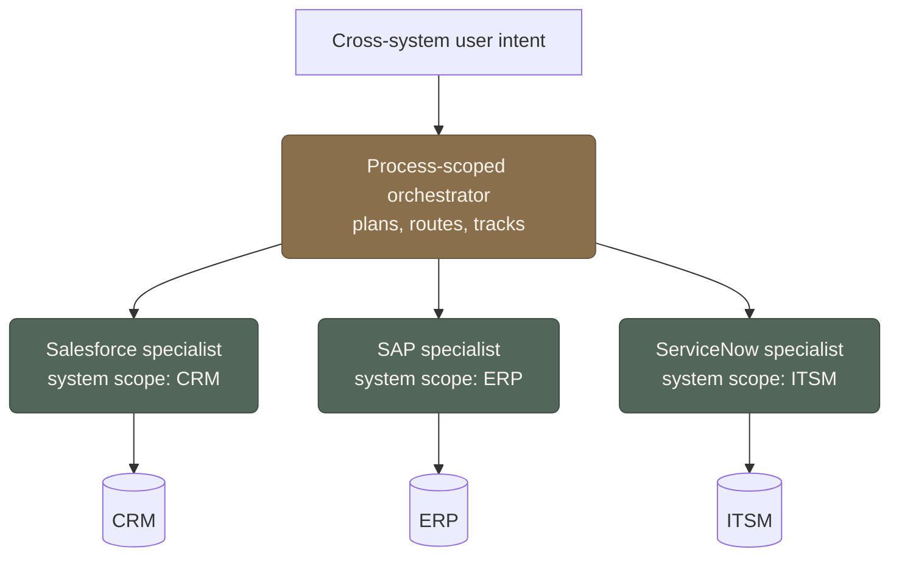

[[scoped-system-specialist-agents|Scoping an agent to one system]] is what makes it governable. It also leaves it stranded the moment a goal crosses a system boundary, which most real goals do. A customer renewal touches the CRM, the billing system, a contract in legal's repository, the calendar, and the support queue. Scope one agent to each and none of them can complete the renewal alone; let one agent reach all five and you've rebuilt the ungovernable do-everything operator scoping was meant to kill.

So you need a coordination layer, and the shape I keep landing on is **broad intent, narrow execution**: a conversational orchestrator holds the messy human goal and decides who does what; each scoped specialist performs the actual mutation, but only inside its own system and permissions. Breadth lives in the *understanding*; narrowness lives in the *doing*. The orchestrator can reason about a goal spanning six systems while holding write access to none of them.

That separation is the easy part to state. The work is in three problems it creates.

**Context handoff without over-sharing.** To brief the billing specialist, the orchestrator has to pass *some* context, but not the whole conversation, which may carry detail billing has no business seeing. Each handoff is a place a boundary can leak, so the orchestrator has to pass the minimum a specialist needs and no more. This is the [[federated-memory-for-enterprise-agents|federated-memory problem]] showing up at runtime instead of in storage: even between cooperating agents, what's *relevant* to share isn't the same as what's *allowed* to cross.

**Transaction ownership.** A renewal that updates the CRM, then billing, then files a contract is a distributed transaction with no shared database underneath it. If billing succeeds and the contract step fails, who owns the half-finished state? Someone has to: the orchestrator is the only layer that sees the whole sequence, so it has to track what committed and what didn't, rather than leaving five specialists each convinced their part is done.

**Clean rollback.** Step three of five fails. You can't always undo steps one and two: you sent the email, the PO is approved. So rollback is rarely a literal reversal; it's compensation (issue a correction, flag the record, notify a human) and an honest report of partial completion. An orchestrator that pretends the whole thing either succeeded or didn't is lying about a state the enterprise will discover later anyway.

None of these are solved. They're the reason a wall of well-behaved specialists still doesn't add up to a working enterprise agent, and the reason the orchestrator, not the model, is where I think the next hard engineering goes.
