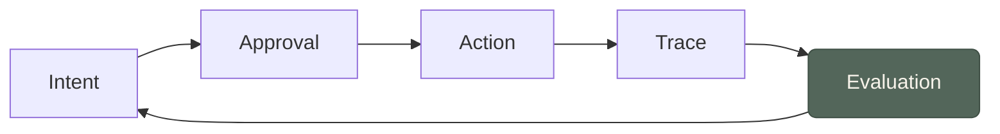

The fantasy is one autonomous agent that runs the whole company. The useful version is narrower: an agent scoped to a single system (Salesforce, SAP, ServiceNow, Jira, Workday) that knows that system deeply and can't touch anything else.

Treat the narrowness as the whole point. A scoped agent can be given the system's real semantics (its objects, permissions, and validation rules), a bounded set of actions, and an audit trail a security team will actually sign off on. A do-everything agent can't be reasoned about: its blast radius is the union of every system it touches, and nobody can say in advance what it will or won't do. Enterprises don't buy capability they can't bound.

Scope also maps onto things organisations already have. It follows an existing integration, so the agent's reach matches a system it already connects to. It follows a role, so a sales-ops agent inherits a sales-ops user's rights and nothing more. And because the action space is bounded, a reviewer can actually enumerate it, which is the difference between an audit that means something and one that waves at a black box. This is just how organisations already divide work: by system and by role, not by one omniscient operator.

What scope buys you is concrete. A Salesforce specialist can inspect an opportunity, explain why a missing field is blocking the next stage, update the next step, log a meeting note, and, when a change is risky or needs sign-off, stop and ask before committing. That's the whole arc: real semantics, a bounded set of actions, a human gate on the irreversible ones. The same shape holds for a ServiceNow or SAP specialist (the [[thoughts/from-chatbots-to-system-operators|essay]] walks through both). In each case the agent stops being a chatbot bolted onto an app and becomes [[the-agent-as-semantic-ui|the interface to the system itself]].

**The caveat that matters:** scope solves governability but creates fragmentation. Real workflows cross systems (a renewal touches CRM, billing, legal, email, calendar, and support tickets), so a wall of narrow agents that can't coordinate is as useless as one broad agent is dangerous. The missing layer is [[orchestrating-scoped-agents|orchestration]]: broad intent, narrow execution. A conversational orchestrator understands the cross-system goal and routes the work; the scoped specialists still do every actual mutation inside their own boundaries. And the hardest of those boundaries is [[federated-memory-for-enterprise-agents|memory]]: what a specialist is allowed to learn and carry.
