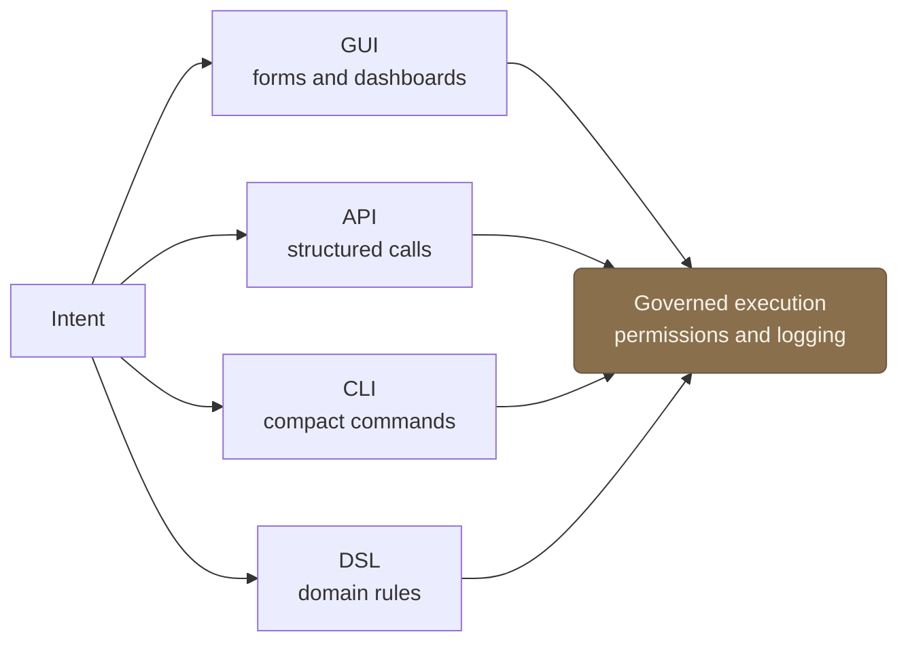

Enterprise software has spent thirty years building forms. The agent is a different surface over the same system: you say what you want, it translates that into governed actions against the underlying APIs, and it reports back in your terms.

Call it a semantic UI. Typing doesn't replace clicking; what changes is the *level*. The interface now sits at **intent** rather than **fields**. "Move every stalled deal over 50k to the renewals team and flag the ones with no activity in the last month" is one sentence. In the GUI it's twenty minutes of filtering, selecting, and clicking. The agent collapses the distance between what you mean and what the system does.

This is not the same thing as a chatbot embedded in the corner of an app. A bolted-on chatbot answers questions *about* the software; it points you at the screen where you'd do the thing. A semantic UI *does the thing*, by issuing the same governed operations the GUI would, against the same system of record. The chatbot is a help surface; the semantic UI is a control surface.

**It does not replace the GUI; it sits above it.** Enterprise users still need dashboards to see state at a glance, bulk-editing tools, visual workflow builders, approval screens, and audit views. Some tasks are inherently spatial or need a human eye on a hundred rows at once; you don't want those narrated through a conversation. And for anything ambiguous or irreversible, the agent should drop the user back down to the explicit surface to confirm.

Two things keep this honest. It has to be [[scoped-system-specialist-agents|scoped to a system]] so the translation is reliable and bounded. And it has to be governed, with every action permissioned, logged, and reversible, because a natural-language layer that can *mutate a system of record* is exactly as dangerous as it is useful: the same sentence that saves twenty minutes can, misread, change a thousand records. When the goal spans several systems, the semantic surface is fronted by an [[orchestrating-scoped-agents|orchestrator]] that fans the work out to the right specialists.
