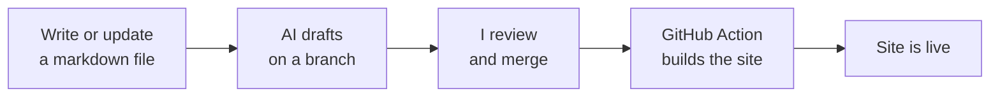

This site is built on a simple but powerful idea: **a living wiki that an AI helps maintain, but that I edit and control.** It's inspired by [Andrej Karpathy's "LLM Wiki" pattern](https://gist.github.com/karpathy/442a6bf555914893e9891c11519de94f) and the way [digital gardens](https://quartz.jzhao.xyz/) work.

## The three layers

The garden is built in three layers, and the difference between them is *who's allowed to touch what*.

<figure role="group" aria-labelledby="layers-fig-title" aria-describedby="layers-fig-desc" style="margin:1.6rem 0;font-family:var(--bodyFont);">
  
The three layers and who may edit each

  
Raw sources are read-only inputs the AI may read but never change. The wiki is the published product, drafted by the AI and approved by me. The schema is the rulebook that governs how the AI maintains the wiki.

  

    

      📥
      
        Raw sources
        Articles, notes &amp; ideas I drop in: immutable inputs.
      
      AI reads only
    

    

      🌳
      
        The wiki
        The interlinked pages you're reading, written &amp; cross-linked by the AI.
      
      AI drafts · I approve
    

    

      📐
      
        The schema
        <code>AGENTS.md</code>: <em>how</em> the AI maintains the wiki: conventions, linking, logging.
      
      Governs the AI
    

  

  <figcaption style="text-align:center;color:var(--gray);font-size:.85em;margin-top:.7rem;">Three layers, three permission levels: the schema governs how the AI turns raw sources into the wiki.</figcaption>
</figure>

## Why it's different from a normal blog

A blog is a stream. A wiki **compounds**: pages get revised as my thinking changes, contradictions get flagged, and connections between ideas become as valuable as the ideas themselves. Nothing is re-derived from scratch; the knowledge is kept current.

## Who's in the loop

I am. I curate the sources, ask the questions, and approve edits (every change is a git commit, like Wikipedia's edit history). The AI does the bookkeeping no human enjoys: summarizing, filing, and keeping links consistent.

## It's all open

- The content and the renderer ([Quartz](https://quartz.jzhao.xyz/)) live in **one public repo**: [FVossebeld/FVossebeld.github.io](https://github.com/FVossebeld/FVossebeld.github.io).
- Every page has a full version history.
- Anyone can propose an edit via pull request; I merge what I agree with.

## How a page gets published

No database, no admin panel: just markdown in git.
