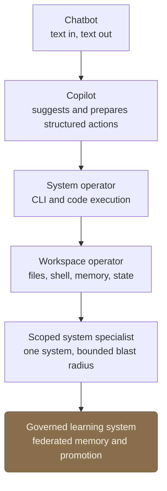
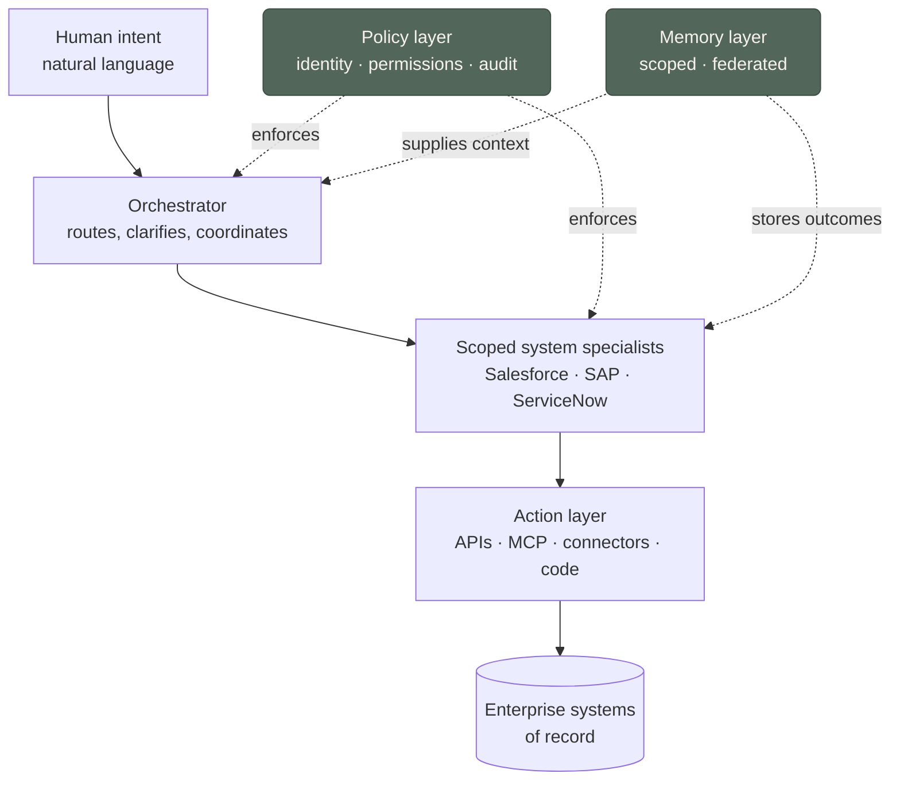

Why do so many enterprise AI products still feel like a chatbot parked _next to_ the software, rather than something that can actually operate it? From where I sit, most of what enterprises run today is still chat, search, summarization, personal productivity, and customer-service bots: a conversation layer sitting on top of documents. Useful, but it leaves the systems of record untouched. The bigger prize is the thing almost nobody has shipped safely yet: AI that can _change the state_ of a business system (move the deal, file the ticket, route the approval) without a human driving every click.

That turns out to be a different problem than making the model smarter. It's a question about the _environment_ the model operates in. I keep watching the same shift happen across the tools I use and the systems I help build, and I want to write down the pattern while it's still in motion. My short version: **LLM agents are turning from chat partners into operators of systems, and the interesting work is moving with them, out of the model and into the interface, the scope, and the memory around it.**

This is a working theory, not a finished one. It's an index essay: I name the pattern here and pull each thread apart on its own [concept page](../concepts/). Expect both to change as I do.

## Chat was the demo

It started with chat. You typed, the model replied. The whole interface was a transcript, and the model's only power was to produce more text. That was the right first move (it made the capability legible to everyone at once), but a transcript is sealed off from anything that isn't language. You can ask it to draft the email; you can't ask it to send the email, check whether the customer already replied, and update the CRM. Chat made LLMs _accessible_. It didn't make them _operational_.

## Tool calling gave the model hands, on the wrong layer

Then we gave it tools, and the standard way was JSON tool calling: the model emits a structured request, some glue code runs it, a result comes back. The instinct was right: agents need to _act_. My read on why it caught on is boring and practical. JSON was already everywhere. If you spent time with the early function-calling stacks, the failure mode was obvious: wrong keys, missing fields, half-formed calls. A fixed schema cleaned that up enough for a runtime to validate and run it. Later structured-output systems tightened the rails even further. That made sense on weaker models, at least from what I saw. They would drop fields, invent fields, or miss the schema in ways that made execution brittle, so strict structured-output checking bought real reliability. On the models I use now, that feels less central at the model-facing layer than it used to. I still want validation before anything runs. I just no longer think the model needs to see every action as a JSON object with required keys.

My claim is narrower. [[json-as-transport-not-cognition|JSON is the right transport layer and probably the wrong cognitive/action layer]]. It's how machines hand structured data to each other: stable, parseable, language-neutral, easy to validate. I'm not saying JSON is bad. I'm saying it belongs lower in the stack. As the layer the model _thinks and acts in_, it is flat and awkward. It describes a call. It does not feel like operating a system. There is no sequencing, no composition, no "if that failed, try this." Every call is a flat object the model fills in blind, then waits for a result whose shape it could not see coming. We bolted the model's hands onto a serialization format because it was convenient.

Compare the same action two ways. The JSON tool call:

```json
{
  "tool": "search_files",
  "arguments": {
    "query": "OPENAI_API_KEY",
    "path": ".",
    "recursive": true,
    "include_line_numbers": true
  }
}
```

The command-line equivalent:

```bash
grep -rn "OPENAI_API_KEY" .
```

The CLI version is shorter, but the real point is context and leverage. A shell surface lets the model search, inspect, filter, diff, and make small edits through one compact interface instead of hauling around a binder full of tool schemas. `grep`, `find`, `git diff`, `jq`, `curl`, and a patch command cover a lot of ground. In practice that often gives the model more room to think, because fewer tokens are spent describing the action surface. [[cli-as-compressed-action-language|The command line is a compressed action language]], and code is the next abstraction past it. Humans already invented compact ways to operate systems (shell, SQL, regex, diffs, config files, logs), and my bet is that models work well through them because those surfaces are common, compact, and close to execution. That is the wider pattern: [[human-tools-not-machine-protocols|agents reach for the tools humans built, not the protocols machines built]]. Agents that work through a shell don't feel like chatbots calling functions. They feel like an engineer at a terminal.

I increasingly think tools come in layers. The model may only need a few primitives up front: work in a CLI or workspace, inspect state, and ask for clarification or approval before a risky mutation. Under that surface, the runtime can still fan out to JSON APIs, MCP servers, and narrow internal tools with validation and policy checks at every step. That keeps JSON where it helps, in the plumbing, without forcing the model to think in nested argument objects.

The honest counterpoint: a shell is _dangerous_ exactly because it's powerful. A loose command can delete files, leak secrets, or mutate state in ways nobody can audit later. "Closer to execution" cuts both ways. A CLI- or code-driven agent needs sandboxing, scoped permissions, and a logged, reviewable trail, which is precisely the governance story the enterprise half of this essay is about.

## The model and the environment co-evolve

I used to phrase this as "the recent capability jump is the environment, not the model." That's too strong, and technically-minded readers are right to push back on it. The better claim is that the two **co-evolve**, and the product is the _coupling_ between them:

- Weak models seem to need rigid schemas and narrow, hand-held tool calls.
- Stronger models, at least in my experience, can operate in messier, more open-ended environments.
- Better environments turn that capability into durable work instead of a clever transcript.

So when someone tells me a new model "feels much more capable," my first guess is that _both_ moved: the weights got better at reasoning and recovery, and someone finally gave them [[agent-workspaces|a place to stand]]: files, a shell, durable memory, state that survives the turn. The model could do more of this than we let it; it now has somewhere to do it. Capability lives in the coupling, not in either half alone.

## Where this points: from chat to a governed operator

Stack those shifts up and you get a progression. Each step doesn't replace the last so much as wrap it in more environment and more governance.



## The useful enterprise shape is scoped, not omniscient

Point a capable agent at a real environment and the question becomes _which_ environment. The fantasy is one autonomous agent that runs the company. The useful version is much narrower: [[scoped-system-specialist-agents|agents scoped to a single system]] (Salesforce, SAP, ServiceNow, Jira, Workday) that know that system deeply and can't touch anything else.

The narrowness is the design, not a compromise. Scope is what makes an agent _governable_, and governability is what enterprises actually buy. A Salesforce-scoped agent can be handed the system's real semantics (its objects, permissions, validation rules), a bounded set of actions, and an audit trail a security team will sign off on. A do-everything agent can't be reasoned about: its blast radius is the union of every system it touches.

At that point the agent stops being a feature bolted onto an app and becomes [[the-agent-as-semantic-ui|a semantic interface to the system itself]]. You state intent; it translates that into governed, logged actions. Concretely, a Salesforce agent should be able to inspect an opportunity, explain why a field is blocking the next stage, update the next step, log a meeting note, and, when a change is risky or needs approval, _stop and ask_ before committing. A ServiceNow agent classifies an incident, checks related ones, proposes a resolution, escalates per policy, and records what changed and why. An SAP procurement agent checks a PO's status, spots the missing approval, compares vendor terms, and routes a change request to the right approver.

Two caveats keep this honest. First, the agent doesn't replace the GUI; it becomes a new _intent-level_ surface above it. Enterprises still need dashboards, bulk editing, approval screens, and audit views; "move every stalled deal over 50k to renewals and flag the ones idle for a month" is one sentence for the agent and a forms marathon for a human, but the forms still have to exist underneath. Second, and this is the gap most "give every team an agent" pitches skip, **scoped agents are not enough on their own, because real work crosses systems.**

## The orchestration problem: broad intent, narrow execution

Take a plausible request: _"After this customer meeting, update the opportunity, create a follow-up task, send the team a summary, and check whether there are open support issues."_ That touches CRM, task management, email, support tickets, and calendar context. A single broad agent with reach into all of them is the ungovernable thing I just argued against. But five isolated agents that can't talk to each other can't do it either.

The missing layer is [[orchestrating-scoped-agents|orchestration]], and the pattern I keep landing on is **broad intent, narrow execution**: a conversational orchestrator understands the messy human goal, asks clarifying questions, and routes work, but every actual system mutation is delegated to a scoped specialist that stays inside its boundary. The orchestrator coordinates; it never reaches into a system directly.

That gives a rough architecture, less a finished blueprint than the boxes I keep redrawing:



The policy layer (identity, permissions, tenant boundaries, approvals, logging) and a verification layer of dry runs, human approval, and rollback aren't optional add-ons. In a regulated enterprise they're the reason the thing is allowed to run at all.

## The hard, unfinished part: memory

The deepest problem isn't action. It's memory, and I think it's where this whole architecture is won or lost. An agent that can't learn is a tool; an agent that learns by pooling everything it sees is a leak. The valuable lesson and the sensitive detail arrive in the _same_ episode: "last time this customer's integration failed, the fix was X" is worth keeping; the customer's name, data, and credentials are not things to carry into the next customer's session. Dump every transcript into one store and retrieve by similarity, and you've built the lesson and the leak into the same lookup.

So "memory" can't be one undifferentiated bucket. It's layered (thread, user, project, customer, team, organization, plus procedural memory and reusable skills), and each layer needs different access rules. [[federated-memory-for-enterprise-agents|Enterprise memory has to be federated]]: partitioned by boundary, retrieval conditioned on policy, every entry tagged with scope, owner, provenance, sensitivity, and expiration. The real question isn't "how do we remember more?" It's _"how does an agent generalize a useful lesson without carrying private detail across a boundary?"_

The mechanism I find most convincing is a [[memory-promotion-pipeline|promotion pipeline]] (raw episode → private memory → sanitized lesson → approved playbook → reusable skill) where each arrow is a _gate_ that strips specificity and adds review, not a step that everything passes by default. "Customer X's SAP integration failed because field Y was misconfigured" should never leave X's tenant; the skill it teaches ("check auth, then field mappings, then validation rules") is worth sharing with everyone. Same knowledge, different boundary. The [[memory-promotion-pipeline|pipeline page]] walks the full ladder and the ways each gate fails.

The lesson worth keeping and the detail worth protecting arrive together; the whole design problem is separating them on the way up. Learning without leaking is the gate, not the conveyor belt.

## What comes next

Put it together and the through-line is simple: we're giving language models the action languages, environments, scopes, orchestration, and memory that humans already use to operate systems. Chat was the demo. The system operator is the product.

My bet on where the value lands: the next generation of enterprise GenAI won't be won by the chatbot with the best personality. It'll be won by systems that can safely turn intent into action: scoped agents that understand one system deeply, act through governed interfaces, coordinate under an orchestrator, remember within the right boundaries, and convert experience into reusable skills without leaking private context. The capability is mostly here. The unsolved part is governed learning: letting these things get better from experience without betraying the boundaries that make them safe to deploy at all.

The concept pages linked above are where I take each thread apart. They're the rest of this argument.
