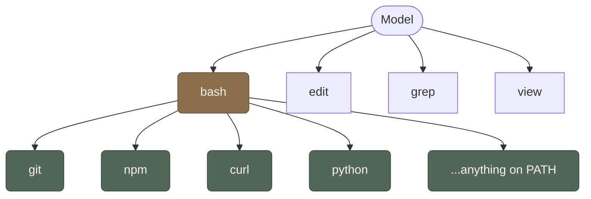

Here is a pattern I keep noticing in what agents actually use. Give a model the ability to act on a system, and the interface that sticks is almost always one humans built for other humans: the shell, files, SQL, regex, diffs, config files, logs, and increasingly the browser. The interfaces that don't stick are the ones we built for machines to talk to each other: bespoke RPC, gRPC, SOAP, message buses, and the per-tool JSON-RPC schemas we keep inventing for tool calling.

That is a strange inversion if you sit with it. For decades we designed machine-to-machine protocols precisely to _escape_ the human interface. Parsing a CLI's output was fragile, so we built APIs that returned structured data. Now the most capable machine we have works best by going back through the human surface: it would rather read `git diff` than call a versioning API, rather type `grep -rn` than fill in a search tool's argument object.

The reason is mundane and it is about training data. A model is fluent in the tools that show up millions of times in the corpus it read. There are millions of shell sessions, SQL queries, and Stack Overflow answers; there are almost no public examples of your company's internal RPC schema. So the human tool is one the model already inhabits, and the machine protocol is one it has to be taught per tool, every time, in the prompt. One is native vocabulary. The other is a phrasebook you hand it at the door.

There is a less obvious reason too, and it is about structure. The filesystem is hierarchical: folders inside folders, names that tell you what is inside. We built it that way for ourselves, so we could find things and bring in the right context at the right moment without holding everything in our heads. In theory you could dump every file into one flat directory and rely on search. Nobody does, because the tree is how a finite mind navigates a large space. Now look at what agents do: they `ls`, they `cd`, they read a directory listing to decide which file to open next. The hierarchy works for them for the same reason it works for us. They have a limited context window the way we have a limited working memory, and a well-named folder tree is a compression scheme for both. We did not design the filesystem for agents. We designed it for creatures with bounded attention, and the model happens to be one.

There is also a historical reason the machine protocols stuck. Part of it, from what I saw, was that early tool-using models sprayed malformed arguments unless you boxed them in. Rigid JSON cleaned that up enough to ship. Useful then. Harder to justify as the model-facing action layer now that the model can handle something richer.

## Tiered tools

There is a shape to how agents actually call tools, and it mirrors the hierarchy. The model does not talk to the world directly. It calls a small set of typed tools: `bash`, `edit`, `grep`, `view`, a handful more. Those are the ones closest to the model, invoked by structured tool calling with a schema the runtime validates. But `bash` is not one tool. It is a door into everything the shell can reach: `git`, `npm`, `curl`, `docker`, `python`, `jq`, and anything else on the PATH. One structured call fans out into thousands of possible actions.

So the tool surface is tiered. A few formal entry points at the top, validated by schema. Below that, the full Unix toolbox, accessed through the human interface of the command line. The model gets both: the safety of structured calls where the runtime can check arguments, and the expressiveness of a shell where it can compose arbitrary pipelines. The hierarchy is doing real work. It is not a leaky abstraction; it is the design.

This is the thread running under a few things I have written separately. It is why [[cli-as-compressed-action-language|the command line works so well as an action language]]: it is the densest human tool we have, and the model has read all of it. It is why [[json-as-transport-not-cognition|JSON belongs lower in the stack than we put it]]: a tool schema is a machine protocol wearing the costume of a cognitive layer, and the model fills it in blind. And it is why browser-use agents click through a web UI built for people instead of calling the clean API sitting right behind it. The API is, to the model, the less familiar surface.

The honest counterpoint is that the human tools are exactly the messy, stateful, dangerous things that protocols were invented to replace. A CLI is underspecified, output formats drift, and "closer to execution" means closer to deleting the wrong directory. Protocols give you validation, determinism, and an audit trail, and you do not get those for free from a shell prompt. So the bet here is not "throw the protocols away." It is the same split I keep landing on: keep the machine protocol as the transport underneath, and let the model operate through the human-facing surface on top, inside a harness that makes the human surface safe to hand to a tireless operator that never gets bored or scared.

The forward question is which human tools we choose to expose, and how we govern them. We built the shell, SQL, and the browser for a careful, slow, mortal user who feels consequences. None of them were designed for something that will run ten thousand commands an hour and has no instinct for when to stop. The tools fit the model better than the protocols do. They just were not built for _this_ user, and closing that gap is most of the [[thoughts/from-chatbots-to-system-operators|work around the model]].
