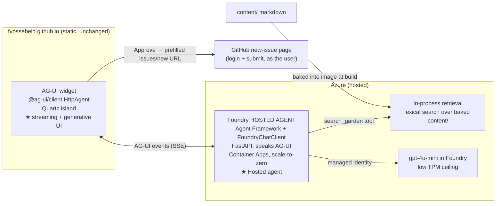

# AG-UI + Foundry agent — as-built

Internal design note (not published). A public, interactive agent on the garden that you
can ask things, that answers **from the garden's own pages with citations**, and that can
turn a thought into a GitHub issue — without risking the Azure bill or handing out a write
credential.

It showcases two things end to end:

1. **AG-UI** — live token streaming, a generative-UI issue card, human-in-the-loop approval.
2. **A Foundry hosted agent** — Microsoft Agent Framework in a container, model in Azure AI
   Foundry, reached with a managed identity.

Everything lives in this one repo. The static Pages build stays untouched.

> **This note records the as-built system.** It diverges from the first plan in three ways,
> all in the direction of _less_: retrieval is **in-process**, not Foundry IQ; the widget is
> built directly on **`@ag-ui/client`**, not CopilotKit; the container **scales to zero**
> instead of running an always-on floor. The "why" is in [Divergences](#divergences-from-the-first-plan).

## The hard constraints (these drove every decision)

- **Cost-safe by construction.** Idle cost is ~zero and the spend _rate_ is capped, so the
  worst case is a known, small number.
- **The Pages build stays clean.** `deploy.yml` runs `npx quartz build` over `content/` and
  ships `public/`. The backend folders (`agent/`, `infra/`) are invisible to it.
- **No secrets in the repo.** Model auth is a managed identity; the deploy pipeline is
  GitHub OIDC; issue posting uses GitHub's own login. There is no key or OAuth secret to leak.

## Why a static site can't do this alone

A browser page has no server and no safe place for a credential. The Foundry model needs
Entra auth, server-side. So this is a hybrid: the static garden hosts the **chat UI**, and a
small Azure backend hosts the **agent**. The agent is "hosted" by design — that's the showcase.

## Architecture



### Request flow

1. Visitor opens the widget on a garden page and asks a question.
2. The widget streams the turn to the hosted agent over **AG-UI** (HTTP + SSE).
3. The agent calls its `search_garden` tool — **in-process lexical retrieval** over the
   garden's markdown (baked into the container image). It answers grounded in the actual
   pages and links back to them.
4. If the visitor wants to file a thought, the agent calls `draft_github_issue`; the widget
   renders an **editable issue card** (title, body) — human-in-the-loop.
5. On _Review & open_, the widget hands off to GitHub's prefilled
   `…/issues/new?title=…&body=…&labels=from-agent` URL. GitHub handles the login and the
   final submit, as the visitor. No token, no OAuth, no stored credential.
6. If actually showing a page is the point — the visitor asks to be taken somewhere, or
   the answer _is_ a page — the agent calls `navigate_garden` and the widget sets that page
   as the active page (see [Agent-driven navigation](#agent-driven-navigation)).

## Grounding: in-process retrieval

`agent/app/garden.py` reads the garden's markdown, splits it into heading-scoped chunks, and
does lexical (term-overlap) ranking. The container bakes `content/` to `/app/knowledge` at
build time, so the agent's knowledge is a snapshot of the published garden. The system prompt
embeds a catalog of page titles so the model knows what exists before it searches.
`search_garden` returns the top few matches, each trimmed to a citation-sized snippet, so a
turn's tool output stays small even when the matched section is long.

Why not Foundry IQ / Azure AI Search (the first plan)? The garden is ~a dozen pages. Lexical
search over that is instant, good enough, and adds **zero standing cost** and zero extra
infrastructure. Foundry IQ would mean an Azure AI Search resource (the main always-on bill)
and a Blob indexing pipeline for a corpus that fits in memory. The clean choice was to drop
it. If the garden grows large enough that lexical recall hurts, revisit embeddings/Foundry IQ.

**Knowledge refresh:** because `content/` is baked into the image, refreshing the agent's
knowledge means redeploying it (the `agent-deploy.yml` pipeline). That's fine for a garden
that changes a few times a week.

## Issue posting: the clean path (Tier 1)

The cleanest write path is the one that holds no write power. The agent **drafts** the issue
(generative UI, in-app), the visitor reviews/edits, and the actual create happens on GitHub's
own new-issue page via a prefilled URL. The "must log into GitHub" requirement is satisfied by
GitHub itself, and there is nothing to leak.

**Future upgrade (Tier 2):** if posting should complete without leaving the page, add a GitHub
App + OAuth so the agent posts via the user's user-to-server token. More moving parts
(server-side secret, token handling) — only worth it if the in-app finish matters.

## Agent-driven navigation

The agent can set another page as the **active page** — the visitor asks "take me to the
agent-memory note" and the garden actually goes there. This reuses the exact pattern that
draws the issue card, so there is one mental model for "the model decides, the frontend acts":

- **Server-side tool, frontend action.** `navigate_garden(slug)` is a real tool in the
  agent's `tools=[…]`, so the _model_ chooses to call it. It only validates the slug against
  the baked catalog and echoes the destination back; it cannot move the browser itself. The
  widget watches the AG-UI tool-call event stream (`onToolCallStart/Args/End`), parses the
  slug, and performs the navigation. AG-UI has no built-in "navigate" event — frontend-defined
  behaviour on top of a tool call is how you get one, and the frontend stays in control (it
  ignores same-page targets and malformed slugs).
- **Navigate via Quartz's SPA router, not `location`.** A hard location change would tear down
  the chat island. The widget calls `window.spaNavigate(url)` so Quartz morphs the page in
  place.
- **The conversation survives the morph.** Quartz morphs `document.body` positionally on SPA
  nav, which wipes the live chat log (micromorph's `data-persist` doesn't protect a running
  subtree here). So the widget snapshots the transcript, the editable issue-card fields, the
  model context (`agent.messages`, capped to the most recent turns), and the open/closed state into `sessionStorage` — written
  in a `window.addCleanup` hook that runs _after_ the new HTML is fetched but _before_ the
  morph — and rehydrates on the next `nav` init. Listeners are wired through `addCleanup`
  (the canonical island pattern) instead of a `data-wired` attribute, which the morph strips.

## Cost safety

What's actually in place:

- **Scale-to-zero.** The Container App is `minReplicas: 0`, so when no one is chatting it
  runs nothing and bills nothing (first request after idle cold-starts in ~10–30s).
- **Rate ceiling.** The gpt-4o-mini deployment has a low TPM cap (capacity 20, GlobalStandard).
  Pay-as-you-go can't exceed its TPM, so the spend _rate_ is bounded no matter the load.
- **Bounded per-turn cost.** The widget is stateless and replays the whole conversation each
  turn, so without a guard the per-turn token count climbs until it trips that TPM cap and the
  run errors out after a handful of messages. The agent applies native Agent Framework
  compaction (a `TokenBudgetComposedStrategy` that drops all but the latest tool-call group,
  keeps the recent turns, and holds the history under a token budget while preserving the
  system prompt), so every turn stays small and the chat keeps running however long it gets.
  The widget also caps the history it replays to the last ~20 messages.
- **Pay-per-token model.** Free when idle; no provisioned-throughput floor.

What is **not** built yet (honest gaps, all from the original plan):

- **No abuse protection** — no Cloudflare Turnstile, no global daily token cap in the agent
  ingress. The endpoint is public and anonymous, bounded only by model TPM. Fine for a
  low-profile showcase; add a daily cap + Turnstile before promoting it.
- **No budget kill-switch** — no Azure budget → action group → capacity-0 runbook. The TPM
  cap bounds the rate; there is no automated hard dollar stop. Add one if the endpoint gets
  real traffic.

## Monorepo layout (as-built)

```text
content/                       published garden (unchanged)
quartz/components/
  GardenAgent.tsx              the island: markup + wires in the script and styles
  scripts/gardenAgent.inline.ts  AG-UI client (HttpAgent) chat logic, bundled by Quartz esbuild
  styles/gardenAgent.scss      palette-aware, dark-mode-safe styles
agent/
  app/server.py                Agent + FoundryChatClient + AG-UI FastAPI endpoint + CORS + /health
  app/garden.py                in-process lexical retrieval over baked content/
  requirements.txt             pinned agent-framework + ag-ui + azure-identity set
  Dockerfile                   python:3.12-slim; bakes content/ → /app/knowledge
infra/                         azd + Bicep: Foundry account+project, gpt-4o-mini, Container App, ACR, UAMI, App Insights
azure.yaml                     azd service definition (host: containerapp)
.github/workflows/
  deploy.yml                   existing Pages build — path-filtered to ignore backend folders
  agent-deploy.yml             azd provision + deploy over GitHub OIDC (no secrets)
  index-content.yml            unused no-op skeleton (kept for a future Foundry IQ path)
```

The one rule that keeps Pages clean: root `npm ci` + `npx quartz build` keeps passing,
untouched. The widget is not a separate toolchain — Quartz's own esbuild bundles
`@ag-ui/client` into the component's `afterDOMLoaded` script, exactly like it does d3 for the
graph and flexsearch for search.

## Why these technology choices

- **Microsoft Agent Framework + `FoundryChatClient`** — first-class AG-UI integration
  (`add_agent_framework_fastapi_endpoint` emits AG-UI/SSE with no hand-rolled bridge), and the
  Foundry client is the current, non-deprecated path to a Foundry project model.
- **`@ag-ui/client` directly, not CopilotKit** — the protocol-level client is a few KB of glue
  and needs no React runtime or provider tree. Quartz bundles it; the whole widget is one
  component plus one inline script. Less code, faithful to the protocol.
- **Azure Container Apps, scale-to-zero** — a real hosted agent with a true ~zero idle floor.
  (The first plan worried this would "lose the hosted-agent angle"; it doesn't — it's still a
  container Foundry's model serves, just one that sleeps.)
- **Prefilled-URL posting** — removes the write credential from the system entirely.

## Deploy pipeline (no secrets)

`agent-deploy.yml` runs the canonical azd CI flow: `Azure/setup-azd`, `azd auth login` with a
**GitHub OIDC federated credential**, then `azd provision` + `azd deploy`. The Entra app
registration, its federated credential (`repo:…:ref:refs/heads/main`), its Contributor + User
Access Administrator role assignments, and the non-secret repo Actions variables
(`AZURE_CLIENT_ID`, `AZURE_TENANT_ID`, `AZURE_SUBSCRIPTION_ID`, `AZURE_ENV_NAME`,
`AZURE_LOCATION`) are provisioned in the demo tenant. Nothing secret is stored in the repo.

The pipeline is manual (`workflow_dispatch`) or fires when `agent/**`, `infra/**`, or
`azure.yaml` change on `main`. The federated subject is `main`, so the first green run lands
when this work merges.

## Divergences from the first plan

| First plan                                                                          | As-built                                                                       | Why                                                                                             |
| ----------------------------------------------------------------------------------- | ------------------------------------------------------------------------------ | ----------------------------------------------------------------------------------------------- |
| Foundry IQ + Azure AI Search + Blob indexing pipeline                               | In-process lexical retrieval over baked `content/`                             | Garden is tiny; lexical is instant and adds zero standing cost. No Search resource, no indexer. |
| CopilotKit React widget, separate Vite toolchain, static bundle in `quartz/static/` | One Quartz component + one inline script on `@ag-ui/client`, bundled by Quartz | Far less code; no second toolchain; faithful to the AG-UI protocol.                             |
| Always-on hosted agent (accept a small floor)                                       | Container Apps `minReplicas: 0`                                                | ~Zero idle cost; cold start is acceptable for a showcase.                                       |
| Turnstile + daily token cap + budget kill-switch                                    | Only TPM cap + scale-to-zero                                                   | Rate is bounded; abuse protection and a hard dollar stop are deferred (see Cost safety).        |
| `index-content.yml` refreshes Blob on `content/**`                                  | Knowledge baked at image build; refresh = redeploy                             | No Blob to refresh. Skeleton kept for a future Foundry IQ path.                                 |

## Open items

- Add abuse protection (Turnstile + daily token cap) and an Azure budget kill-switch before
  promoting the endpoint.
- Optionally publish a polished "how this works" showcase page in `content/` linking this note.
- Revisit Foundry IQ / embeddings only if the garden outgrows lexical retrieval.
