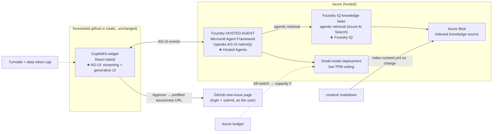

# AG-UI + Foundry agent — build blueprint

Internal design doc (not published). The plan: put a public, interactive agent on the
digital garden that you can ask things, that answers **from the garden's own pages with
citations**, and that can turn a thought into a GitHub issue — without ever risking the
Azure bill or handing out a write credential.

It deliberately showcases three things:

1. **AG-UI** — live streaming, generative UI, human-in-the-loop.
2. **Foundry Hosted Agents** — a real containerized agent Foundry runs.
3. **Foundry IQ** — knowledge base + agentic retrieval grounding the agent in `content/`.

Everything lives in this one repo (monorepo). The static Pages build stays untouched.

## The hard constraints (these drive every decision)

- **Cost-safe by construction.** The worst-case monthly bill must be a known, small
  number — not "however hard the internet hammers it."
- **The Pages build stays clean.** `deploy.yml` runs `npx quartz build` over `content/`
  and ships `public/`. New folders (`agent/`, `widget/`, `infra/`, `scripts/`) are
  invisible to it.
- **No secrets in the repo.** Model auth is managed identity; Azure deploy is OIDC; issue
  posting uses GitHub's own login. There is no API key or OAuth secret to leak.

## Why a static site can't do this alone

A browser page has no server and no safe place for a credential. The Foundry agent needs
Entra auth and the knowledge base needs to be queried server-side. So this is a hybrid:
the static garden hosts the **chat UI**, and a small always-on Azure backend hosts the
**agent + knowledge**. The agent is "hosted" by design — that's the showcase.

## Architecture



### Request flow

1. Visitor opens the widget on a garden page and asks a question.
2. The widget streams the turn to the hosted agent over **AG-UI**.
3. The agent calls **Foundry IQ** agentic retrieval: the query is decomposed into
   subqueries, run in parallel over the indexed `content/`, reranked, and returned with
   citations. The agent answers grounded in the actual pages and links back to them.
4. If the visitor wants to file a thought, the agent emits a **generative-UI card** — an
   editable issue draft (title, body, labels) with an *Approve* button (human-in-the-loop).
5. On *Approve*, the widget hands off to GitHub's prefilled
   `…/issues/new?title=…&body=…&labels=from-agent` URL. GitHub handles the login and the
   final submit, as the visitor. No token, no OAuth, no stored credential.

## Knowledge grounding (Foundry IQ)

Foundry IQ is Foundry's managed knowledge layer: a **knowledge base** unifies one or more
**knowledge sources** (here, an indexed Azure Blob container) and serves the agent via
**agentic retrieval** rather than single-shot RAG — it plans subqueries, runs them in
parallel, semantically reranks, and returns a cited, auditable answer.

Pipeline:

- `scripts/index-content` exports the garden's `content/` markdown to an Azure Blob
  container (the indexed knowledge source). Foundry IQ auto-chunks, embeds, and indexes it.
- `index-content.yml` runs on every `content/**` change (push to `main`) and re-pushes,
  so the agent's knowledge tracks the published garden.
- Citations are a free showcase win: "what does the garden say about X" comes back with
  links to the right pages.

## Issue posting: the clean path (Tier 1)

The cleanest write path is the one that holds no write power. The agent **drafts** the
issue (generative UI, in-app), the visitor reviews/edits, and the actual create happens on
GitHub's own new-issue page via a prefilled URL. The "must log into GitHub" requirement is
satisfied by GitHub itself, and there is nothing to leak.

**Future upgrade (Tier 2):** if posting should complete without leaving the page, add a
GitHub App + OAuth so the agent posts via the user's user-to-server token. More moving
parts (server-side secret, token handling) — only worth it if the in-app finish matters.

## Cost safety: bounded by construction

Two independent ceilings make the worst case a known number:

- **Rate ceiling** — a **low tokens-per-minute (TPM) quota** on the model deployment.
  Pay-as-you-go can't exceed its TPM, so spend rate is capped no matter the load.
- **Total ceiling** — an **Azure budget** whose action group triggers a kill-switch
  (Function/runbook) that sets the model deployment capacity to **0**. Hard dollar stop.

Layered on top to keep us far from those ceilings: Cloudflare **Turnstile** before a
session, a **global daily token cap** in the agent ingress, plus `max_tokens` and
max-turns caps. Anonymous visitors can still try the agent (that's the point of a
showcase), but the blast radius is bounded.

**Standing cost:** the knowledge store — Azure AI Search behind Foundry IQ — is the main
always-on cost. Start on the **Free** tier (the garden is small); move to **Basic** only
if limits bite. The model is pay-per-token (free when idle); the hosted-agent container
has at most a small floor.

## Monorepo layout

```text
content/                       published garden (unchanged)
quartz/                        renderer (don't touch) — except static/ for the widget bundle
  static/ag-ui-widget/         built widget bundle Quartz serves
widget/                        CopilotKit AG-UI widget (React/Vite) — own toolchain
agent/                         Foundry hosted agent (Agent Framework, container, AG-UI)
infra/                         azd + Bicep: model (low TPM), AI Search / Foundry IQ KB, blob, agent, budget + kill-switch
scripts/index-content/         exports content/ markdown → Azure Blob knowledge source
.github/workflows/
  deploy.yml                   existing Pages build — path-filtered to ignore the new folders
  agent-deploy.yml             NEW — azd up to Azure, manual/tag-triggered, Azure OIDC
  index-content.yml            NEW — on content/** change, push markdown to Blob; Foundry IQ re-indexes
```

The one rule that keeps Pages clean: root `npm ci` + `npx quartz build` must keep passing,
untouched, with `widget/` and `agent/` as independent subprojects. The widget is
**pre-built** into a static bundle Quartz serves — Pages never compiles React.

## Why these technology choices

- **Microsoft Agent Framework for the agent** — it has first-class AG-UI integration, so
  the hosted agent emits AG-UI events without a hand-rolled protocol bridge.
- **CopilotKit for the widget** — the reference AG-UI frontend; its generative-UI and
  human-in-the-loop components are exactly the issue-draft-and-approve flow.
- **Foundry IQ for grounding** — managed agentic retrieval with citations, no bespoke
  RAG plumbing.
- **Prefilled-URL posting** — removes the write credential from the system entirely.

## Build phases

| Phase | Deliverable |
|------|-------------|
| 0 | This blueprint. |
| 1 | Monorepo scaffold (`agent/`, `widget/`, `infra/`, `scripts/`); path-filter `deploy.yml`; no-op `agent-deploy.yml` + `index-content.yml`. Pages build still green. |
| 2 | CopilotKit widget against a **mock** AG-UI endpoint: chat + streaming + generative-UI issue card → prefilled-URL handoff. Mounted as a Quartz island behind a feature toggle (off). |
| 3 | Foundry IQ knowledge base + Blob + embeddings model; `scripts/index-content` + `index-content.yml`. Validate agentic retrieval with citations standalone. |
| 4 | Foundry Hosted Agent (Agent Framework, AG-UI) wired to the knowledge base; drafts issues from a thought. Run + invoke locally. |
| 5 | Infra hardening + cost guards: low TPM, App Insights, budget + kill-switch, Turnstile + daily cap; deploy via `agent-deploy.yml` (OIDC). |
| 6 | Wire widget ↔ live agent (CORS + Turnstile); E2E (grounded cited answer + thought→issue); flip the island on; add a public "how this works" page linking this blueprint. |

## Open decisions

- **This doc's home:** stays internal in `wiki/` for now; a polished public showcase page
  comes in Phase 6.
- **Search tier:** Free vs Basic (default Free, upgrade if limits bite).
- **Index refresh:** on `content/**` change vs scheduled (default: on change).
- **Model + numbers:** model (gpt-4o-mini-class), embeddings model, exact TPM, daily
  token cap, monthly budget — TBD when we provision.
- **Posting tier:** Tier 1 (prefilled URL) now; Tier 2 (OAuth in-app) only if needed.
- **Idle cost:** accept a small hosted-agent floor for the showcase, rather than dropping
  to Container Apps scale-to-zero (which loses the Foundry Hosted Agent angle).
